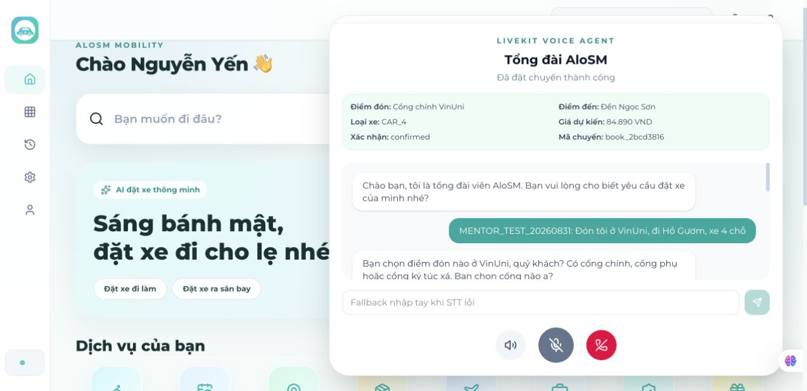
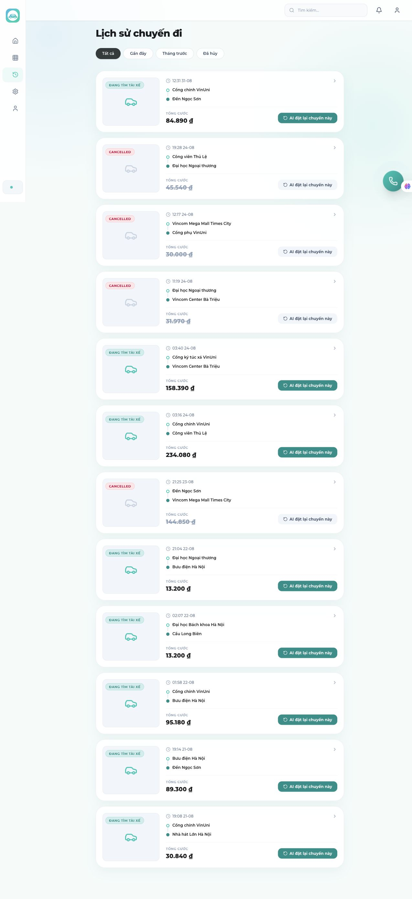
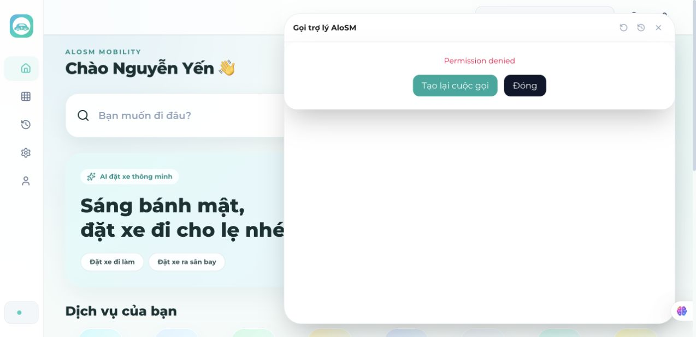
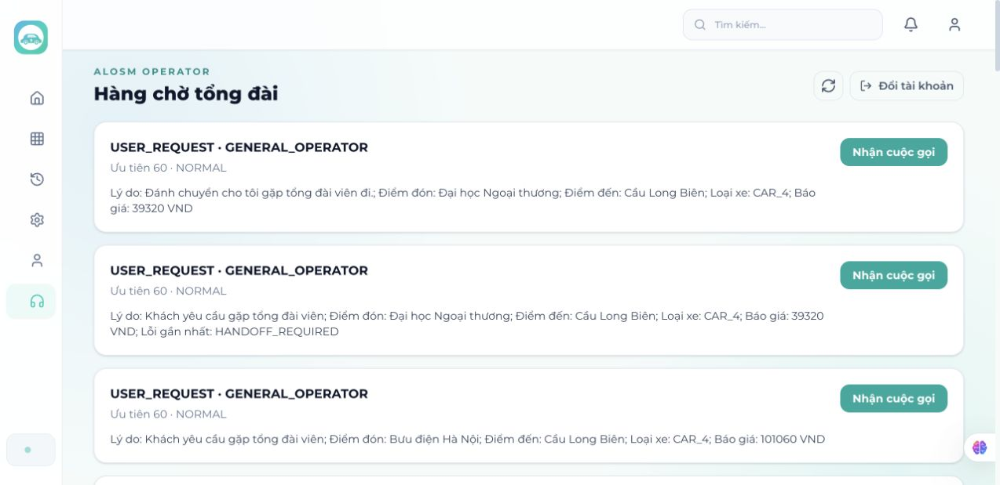
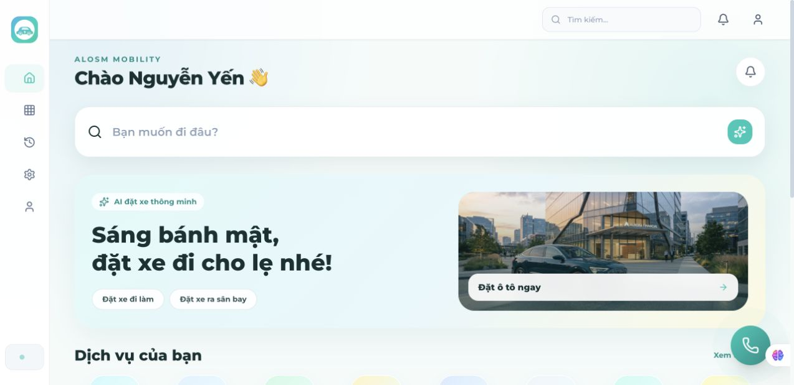
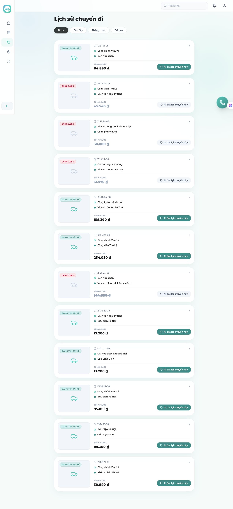
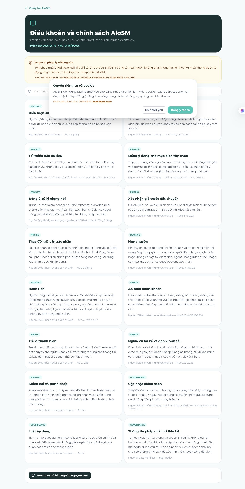
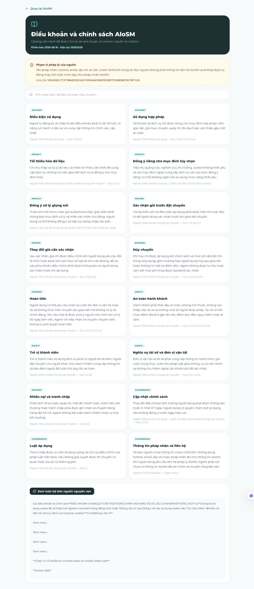
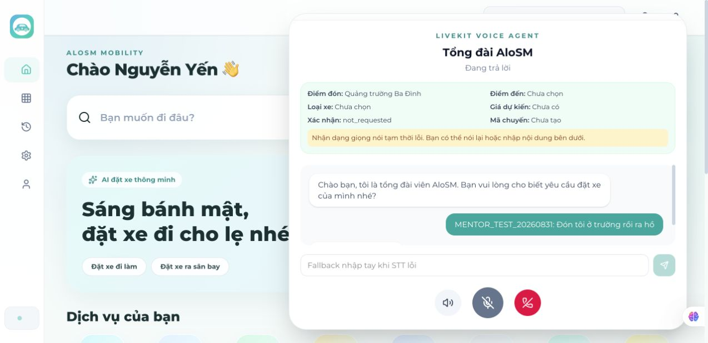

# P-160 — Live E2E 31/08/2026

## Phạm vi và kết quả

- **Batch:** `20260831-113407`; target staging `https://staging.alosm.nairyuuu.site/login`.
- **Source reference:** `origin/main@16febff2764808cef7754824e53525d39a77082a`; live build SHA chưa được UI công bố.
- **Cách chạy:** dùng tài khoản customer/operator demo, dữ liệu `MENTOR_TEST_20260831`, thao tác qua Chrome. Không chạy unit/integration suite.
- **Kết quả:** **28/28 ID đã được đối chiếu: 3 PASS, 3 FAIL, 22 BLOCKED, 0 case chưa chạy**.
- **Blocker chung:** sau một booking thành công, site chuyển sang `Permission denied`; nút thử lại vẫn lỗi và không còn ô nhập text. Đổi microphone permission trong Chrome là thay đổi cài đặt browser, đang chờ xác nhận riêng. Mọi case voice độc lập đã được thử lại trước khi dùng blocker chung.

## Ma trận đầy đủ

| ID | Expected | Actual | Verdict | Evidence | Tái hiện |
|---|---|---|---|---|---|
| P160-F1-HAPPY-001 | Booking chỉ tạo sau xác nhận; có candidate/place ID, quote provenance và một booking ID. | Đặt được đúng một chuyến `book_2bcd3816`, trạng thái confirmed và còn sau đăng nhập lại. UI chỉ hiện tên điểm/giá, không hiện place ID hoặc provenance của quote. | **FAIL** | ,  | 1. Đăng nhập customer. 2. Chọn Cổng chính VinUni và Đền Ngọc Sơn. 3. Xác nhận. 4. Kiểm tra summary và đăng nhập lại. |
| P160-F1-EDGE-002 | Hỏi từng field thiếu và giữ state cũ. | Agent hỏi cụ thể cổng VinUni rồi điểm Hồ Gươm, giữ các field trước đó, chưa booking trước khi đủ dữ liệu. | **PASS** |  | 1. Gửi yêu cầu thiếu cổng/điểm cụ thể. 2. Bổ sung từng lựa chọn. 3. Quan sát state. |
| P160-F1-AI-003 | Không tự chọn địa điểm mơ hồ; đưa candidate để người dùng chọn. | Agent đưa candidate VinUni/Hồ Gươm và chỉ tiếp tục sau lựa chọn. | **PASS** |  | 1. Nói VinUni và Hồ Gươm không kèm cổng/điểm. 2. Kiểm tra candidate. 3. Chọn một candidate. |
| P160-F1-UNHAPPY-004 | Correction làm quote cũ hết hiệu lực và tạo quote mới. | Không thể gửi correction: mọi lần mở voice sau booking đều dừng ở `Permission denied`, không có text fallback. | **BLOCKED** |  | 1. Mở Voice Agent. 2. Bấm tạo lại cuộc gọi. 3. Lỗi xuất hiện trước khi sửa điểm đến. |
| P160-F1-EDGE-005 | “ừ/ok” không booking; xác nhận rõ tạo một booking; retry idempotent. | Xác nhận rõ tạo một booking, nhưng không thể chạy lượt “ừ/ok” và double-submit độc lập sau khi mic bị chặn. | **BLOCKED** |  | 1. Mở Voice Agent. 2. Chuẩn bị quote. 3. Thử xác nhận mơ hồ và double-submit; bước 2 bị chặn. |
| P160-F1-UNHAPPY-006 | Khi mic bị từ chối, UI giải thích và cho nhập text. | UI chỉ hiện `Permission denied`, `Tạo lại cuộc gọi`, `Đóng`; thử lại vẫn lỗi và không có ô text. | **FAIL** |  | 1. Từ chối mic. 2. Mở Voice Agent. 3. Bấm thử lại. 4. Kiểm tra fallback text. |
| P160-F1-AI-007 | ASR confidence thấp phải hỏi lại, không ghi draft. | Không thể cấp audio tiếng ồn vì phiên voice dừng trước ASR ở permission gate. | **BLOCKED** |  | 1. Mở voice. 2. Phát địa danh khó trong tiếng ồn. 3. Gate chặn bước 2. |
| P160-F1-EDGE-008 | Refresh trước confirm khôi phục draft/quote hoặc báo hết hạn, không tự booking. | Không thể tạo draft mới để refresh vì permission gate; booking confirmed chỉ chứng minh persistence sau hoàn tất. | **BLOCKED** |  | 1. Tạo quote chưa confirm. 2. Refresh. 3. Hiện không tới được bước 1. |
| P160-F1-AI-009 | Barge-in dừng TTS cũ, correction thắng state. | Không thể bắt đầu phiên voice/TTS mới sau permission gate. | **BLOCKED** |  | 1. Mở voice. 2. Đợi TTS đọc quote. 3. Ngắt bằng correction; gate chặn bước 1. |
| P160-F1-AI-010 | Entity nhất quán qua accent/noise; phần không chắc được hỏi lại. | Không thể phát bộ audio accent/noise vì voice không khởi tạo. | **BLOCKED** |  | 1. Mở voice. 2. Chạy sáu biến thể accent/noise. 3. Gate chặn bước 1. |
| P160-F2-HAPPY-001 | Yêu cầu người thật tạo handoff ngay, giữ context và AI dừng. | Operator queue mở được nhưng customer không thể gửi yêu cầu handoff mới do voice gate. | **BLOCKED** |  | 1. Customer mở voice. 2. Nói yêu cầu tổng đài viên giữa draft. 3. Gate chặn bước 1. |
| P160-F2-UNHAPPY-002 | Sau hai lần ASR fail phải offer text/handoff. | Không thể đưa audio vào ASR; UI đã thiếu text fallback ngay tại permission failure. | **BLOCKED** |  | 1. Gửi hai audio không hiểu được. 2. Quan sát fallback; permission chặn trước ASR. |
| P160-F2-EDGE-003 | Operator takeover chỉ còn một owner và nhận context mới nhất. | Đăng nhập operator được nhưng không tạo được phiên customer mới để takeover lúc AI đang trả lời. | **BLOCKED** | ,  | 1. Customer tạo draft. 2. Operator takeover khi correction đến. 3. Bước 1 bị chặn. |
| P160-F2-SEC-004 | Customer không mở operator; operator hợp lệ chỉ thấy context cần thiết. | Customer vào `/operator` bị đưa về home. Operator demo vào được queue và chỉ thấy reason, pickup/destination/vehicle/quote, không thấy tên/số điện thoại. | **PASS** | ,  | 1. Đăng nhập customer và mở `/operator`. 2. Đăng nhập operator. 3. So sánh dữ liệu. |
| P160-F3-HAPPY-001 | Price-only trả estimate/provenance/disclaimer và không booking. | Không thể gửi price-only query do voice gate. | **BLOCKED** |  | 1. Mở voice. 2. Hỏi giá không yêu cầu đặt. 3. Gate chặn bước 1. |
| P160-F3-HAPPY-002 | Trip ID đúng trả provider state; ID lạ not-found/no-access. | Activity xác nhận booking của chính user còn tồn tại, nhưng không thể hỏi agent bằng ID đúng/sai. | **BLOCKED** | ,  | 1. Lấy booking ID. 2. Hỏi ID đúng và ID giả. 3. Gate chặn bước 2. |
| P160-F3-AI-003 | Policy/paraphrase nhất quán, có source/version mở được. | Trang policy public có version `2026-08-16`, SHA và bản nguồn mở được; chưa thể hỏi agent hai paraphrase. | **BLOCKED** | ,  | 1. Mở policy. 2. Hỏi agent hai paraphrase. 3. Bước 2 bị chặn. |
| P160-F3-UNHAPPY-004 | Thiếu/xung đột nguồn phải nói thiếu căn cứ, không bịa. | Không thể gửi hai câu hỏi policy adversarial vì voice gate. | **BLOCKED** |  | 1. Hỏi policy không có. 2. Hỏi policy xung đột. 3. Gate chặn bước 1. |
| P160-F9-HAPPY-001 | Emergency ngắt booking và tạo handoff ưu tiên cao. | Không thể tạo draft rồi gửi emergency vì voice gate. | **BLOCKED** |  | 1. Tạo draft. 2. Báo tai nạn. 3. Gate chặn bước 1. |
| P160-F9-UNHAPPY-002 | Không GPS phải hỏi tối thiểu, không bịa vị trí và vẫn handoff. | Không thể gửi emergency-without-GPS vì voice gate. | **BLOCKED** |  | 1. Báo tai nạn. 2. Từ chối GPS. 3. Gate chặn bước 1. |
| P160-F9-READINESS-003 | Có incident ID, consent/location, actor/time và dispatch state. | Không có đường đi tới incident record/112 từ UI; voice gate cũng chặn emergency trigger. | **BLOCKED** |  | 1. Trigger emergency. 2. Tìm incident/consent/dispatch. 3. Gate chặn bước 1. |
| P160-XFLOW-001 | Correction→ASR fail→handoff giữ đúng một draft/quote, không booking. | Không thể khởi tạo chuỗi mới sau permission gate. | **BLOCKED** |  | 1. Tạo draft mơ hồ. 2. Correction. 3. ASR fail. 4. Handoff; gate chặn bước 1. |
| P160-F1-AI-901 | “trường/hồ” phải hỏi rõ cả pickup/destination, không tự gán. | Agent tự gán pickup thành `Quảng trường Ba Đình` dù user chỉ nói “trường”, rồi mới báo thiếu destination. | **FAIL** |  | 1. Gửi `Đón tôi ở trường rồi ra hồ`. 2. Quan sát pickup bị gán sai. |
| P160-F1-AI-902 | Mixed-language/disfluency giữ đúng intent/entity. | Không thể gửi utterance mới do voice gate. | **BLOCKED** |  | 1. Mở voice. 2. Gửi câu mixed-language. 3. Gate chặn bước 1. |
| P160-F1-AI-903 | Correction nhiều field thay toàn bộ state, quote lại và confirm lại. | Không thể tạo quote mới để gửi correction nhiều field. | **BLOCKED** |  | 1. Chuẩn bị quote. 2. Đổi pickup/destination/time. 3. Gate chặn bước 1. |
| P160-F3-AI-904 | Negative confirmation không tạo trip. | Không thể tạo quote độc lập để gửi câu phủ định. | **BLOCKED** |  | 1. Chuẩn bị quote. 2. Gửi `chưa đặt nhé`. 3. Gate chặn bước 1. |
| P160-F3-AI-905 | Hai xác nhận tự nhiên chỉ tạo đúng một booking. | Booking đơn đã tạo, nhưng không thể chuẩn bị draft mới và double-send sau permission gate. | **BLOCKED** | ,  | 1. Chuẩn bị quote. 2. Double-send hai xác nhận. 3. Gate chặn bước 1. |
| P160-F9-AI-906 | Emergency mơ hồ ưu tiên hỗ trợ/handoff, không booking thường hay gọi thật. | Không thể gửi emergency ambiguity trong sandbox do voice gate. | **BLOCKED** |  | 1. Mở voice. 2. Gửi câu tai nạn/đi viện. 3. Gate chặn bước 1. |

## Ưu tiên sửa trước demo

1. Khi mic denied phải giữ text fallback và hướng dẫn bật quyền; retry phải khôi phục phiên.
2. Không tự gán địa điểm khi user nói “trường/hồ”; bắt buộc clarification theo từng entity.
3. Hiện place/provider ID và pricing provenance ở quote/booking summary.
4. Cấp test control để chạy ASR, correction, handoff và emergency độc lập với browser permission cũ.
