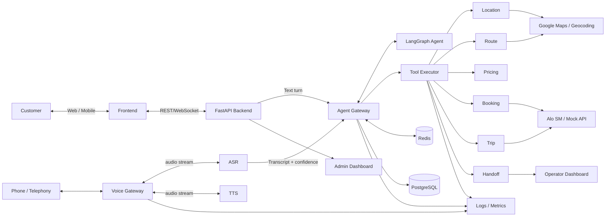
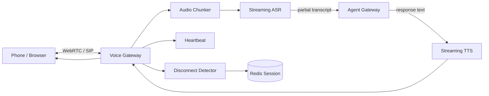

# BACKEND_TODOS — Phân chia Feature theo Role + API Contract

> **Mục tiêu:** biến Backend thành lớp thực thi nghiệp vụ đáng tin cậy giữa Voice/Frontend, Agent và các external services.
>
> **Nguyên tắc kiến trúc đã chốt:**
>
> - **Voice Gateway:** realtime transport — nhận cuộc gọi/audio, quản lý connection lifecycle và chuyển audio/text giữa telephony ↔ speech ↔ backend.
> - **Agent:** reasoning + workflow — hiểu intent, quyết định bước tiếp theo và tạo `AgentAction/ToolCall`.
> - **Backend:** execution + validation + persistence + side effects — thực thi tool, validate dữ liệu, quản lý session, booking, handoff và audit.
> - **Frontend:** giao diện cho khách hàng, tổng đài viên và admin.
>
> Architecture hiện tại xác định 5 tầng: Telephony, Speech, AI Core, Backend và Data; Voice Gateway nằm ở tầng Telephony, còn FastAPI + LangGraph ở AI Core và Redis/PostgreSQL ở Data. fileciteturn6file7L662-L684
>
> Agent contract cũng đã chốt: Agent chỉ trả `ASK_USER`, `RESPOND`, `CALL_TOOL`, `HANDOFF`, hoặc `END_SESSION`; Backend mới gọi Maps/Booking/Trip/Knowledge/Handoff service. fileciteturn6file5L468-L508

---

# Mục lục

- [1. Feature Ownership Map](#1-feature-ownership-map)
- [2. Tổng thể kiến trúc](#2-tổng-thể-kiến-trúc)
  - [2.1. Ba boundary quan trọng](#21-ba-boundary-quan-trọng)
- [3. Role A — Frontend](#3-role-a--frontend)
  - [FE-1 — Authentication](#fe-1--authentication)
  - [FE-2 — Customer Voice Chat](#fe-2--customer-voice-chat)
  - [FE-3 — Text Fallback](#fe-3--text-fallback)
  - [FE-4 — Operator Dashboard](#fe-4--operator-dashboard)
  - [FE-5 — Admin Monitoring](#fe-5--admin-monitoring)
- [4. Role B — Voice Engineer](#4-role-b--voice-engineer)
  - [V-1 — Voice Gateway](#v-1--voice-gateway)
  - [V-2 — Audio Streaming](#v-2--audio-streaming)
  - [V-3 — ASR/TTS Integration](#v-3--asrtts-integration)
  - [V-4 — Disconnect/Reconnect](#v-4--disconnectreconnect)
- [5. Role C — Agent Engineer](#5-role-c--agent-engineer)
  - [A-1 — Intent Routing](#a-1--intent-routing)
  - [A-2 — Booking Workflow](#a-2--booking-workflow)
  - [A-3 — Trip / FAQ / Handoff](#a-3--trip--faq--handoff)
  - [A-4 — Guardrails &amp; Evaluation](#a-4--guardrails--evaluation)
- [6. Role D — Backend Engineer](#6-role-d--backend-engineer)
  - [BE-1 — Agent Gateway](#be-1--agent-gateway)
  - [BE-2 — Session &amp; State](#be-2--session--state)
  - [BE-3 — Location Resolution](#be-3--location-resolution)
  - [BE-4 — Route &amp; ETA](#be-4--route--eta)
  - [BE-5 — Pricing](#be-5--pricing)
  - [BE-6 — Booking &amp; Idempotency](#be-6--booking--idempotency)
  - [BE-7 — Trip Lookup](#be-7--trip-lookup)
  - [BE-8 — Handoff &amp; Context Transfer](#be-8--handoff--context-transfer)
  - [BE-9 — Background Jobs](#be-9--background-jobs)
  - [BE-10 — Reliability &amp; Observability](#be-10--reliability--observability)
- [7. API Contract — Tổng hợp để FE/Voice/Agent test](#7-api-contract--tổng-hợp-để-fevoiceagent-test)
- [8. Folder Structure](#8-folder-structure)
- [9. MVP — Tuần 1 → 3](#9-mvp--tuần-1--3)
- [10. Week 2 — Real Business Flow](#10-week-2--real-business-flow)
- [11. Week 3 — MVP Freeze](#11-week-3--mvp-freeze)
- [12. Demo Day — Week 4 → 6](#12-demo-day--week-4--6)
- [13. Contract giữa các team](#13-contract-giữa-các-team)
- [14. Research Questions](#14-research-questions)
- [15. Final Ownership](#15-final-ownership)

---

# 1. Feature Ownership Map

Thay vì chia project thành `Frontend / Backend / Agent / Voice` theo layer kỹ thuật, chia thành **vertical features**. Mỗi feature phải trả lời:

```text
Feature
  ↓
Pain point nào?
  ↓
User flow nào?
  ↓
API / Event contract nào?
  ↓
Ai implement?
  ↓
Ai phụ thuộc?
  ↓
Test bằng gì?
  ↓
Metric nào chứng minh feature hoạt động?
```

## 1.1. Tổng quan

| ID    | Feature                      | Primary Owner      | BE involvement      | Priority | Pain point                                    |
| ----- | ---------------------------- | ------------------ | ------------------- | -------- | --------------------------------------------- |
| FE-1  | User/Operator Authentication | FE + BE            | API/Auth            | P0       | Không có identity/session rõ ràng         |
| FE-2  | Customer Voice Chat          | FE + Voice + BE    | Session/stream API  | P0       | Người dùng không rành công nghệ        |
| FE-3  | Text Fallback                | FE + BE + Agent    | Text turn API       | P0       | Voice/ASR thất bại                          |
| FE-4  | Operator Case Dashboard      | FE + BE            | Handoff APIs        | P0       | Tổng đài viên thiếu context              |
| FE-5  | Admin Monitoring             | FE + BE            | Metrics APIs        | P1       | Không biết hệ thống đang lỗi/đang tải |
| V-1   | Voice Gateway                | Voice + BE         | Session/events      | P0       | Audio connection không ổn định            |
| V-2   | Audio Streaming              | Voice + BE         | Streaming contract  | P0       | Voice latency cao                             |
| V-3   | ASR/TTS Integration          | Voice + BE         | Speech contract     | P0       | Nhận diện sai/chậm                         |
| V-4   | Disconnect/Reconnect         | Voice + BE         | Session recovery    | P1       | Mất context khi mạng yếu                   |
| A-1   | Intent Routing               | Agent              | Agent contract      | P0       | Agent chọn sai workflow                      |
| A-2   | Booking Workflow             | Agent              | Tool APIs           | P0       | Không hoàn thành booking                   |
| A-3   | Trip/FAQ/Handoff Workflow    | Agent              | Tool APIs           | P1       | Không xử lý được request ngoài booking |
| A-4   | Guardrails & Evaluation      | Agent + BE         | Validation/logging  | P0       | Hallucination / booking sai                   |
| BE-1  | Agent Gateway                | BE                 | Core                | P0       | Agent gọi side effect không kiểm soát     |
| BE-2  | Session & State              | BE                 | Core                | P0       | Mất context                                  |
| BE-3  | Location Resolution          | BE                 | Tool API            | P0       | Sai địa chỉ                                |
| BE-4  | Route & ETA                  | BE                 | Tool API            | P0       | Agent tự suy diễn route/ETA                 |
| BE-5  | Pricing                      | BE                 | Tool API            | P0       | Agent tự suy diễn giá                      |
| BE-6  | Booking & Idempotency        | BE                 | Tool API            | P0       | Đặt sai/trùng xe                           |
| BE-7  | Trip Lookup                  | BE                 | Tool API            | P1       | Không biết trạng thái chuyến             |
| BE-8  | Handoff & Context Transfer   | BE + Agent + Voice | Tool + operator API | P0       | Handoff sai/thiếu context                    |
| BE-9  | Background Jobs              | BE                 | Celery              | P1       | Tác vụ chậm/block realtime path            |
| BE-10 | Reliability & Observability  | BE                 | Cross-cutting       | P1→P0   | Không debug/scale được                    |

---

# 2. Tổng thể kiến trúc



## 2.1. Ba boundary quan trọng

### Voice Gateway

```text
Realtime transport
      ↓
audio/session lifecycle
      ↓
ASR/TTS streaming
      ↓
Agent Gateway
```

Voice Gateway **không quyết định business logic**.

### Agent Gateway

```text
Input
  ↓
Load session
  ↓
Agent
  ↓
AgentAction
  ↓
Validate
  ↓
Execute tool
  ↓
Persist state
  ↓
Return response
```

### Agent

```text
Transcript
  +
Current State
  +
ToolResult
       ↓
Reasoning / Workflow
       ↓
AgentAction
```

Agent README quy định state phải là single source of truth với `session_id`, `current_workflow`, `current_step`, `collected_data`, `pending_tool_call_id`, `retry_count`; state được update bằng partial `state_updates`. fileciteturn6file5L439-L466

---

# 3. ROLE A — FRONTEND

Frontend có **4 nhóm màn hình chính**.

---

# FE-1 — Authentication

**Owner:** FE + BE
**Priority:** P0

## Pain point

Có ba nhóm user khác nhau:

```text
Customer
Operator
Admin
```

Nếu không có identity/role rõ ràng:

- operator có thể xem case của user khác không kiểm soát;
- admin không phân biệt được dữ liệu;
- backend không biết session thuộc user nào.

## Screens

### Customer

```text
/login
/register
```

### Operator

```text
/operator/login
```

### Admin

```text
/admin/login
```

## APIs

### POST `/api/v1/auth/register`

Request:

```json
{
  "full_name": "Nguyen Van A",
  "phone": "0901234567",
  "password": "example-password"
}
```

Response:

```json
{
  "user_id": "usr_001",
  "role": "CUSTOMER",
  "access_token": "jwt-token"
}
```

### POST `/api/v1/auth/login`

Request:

```json
{
  "phone": "0901234567",
  "password": "example-password"
}
```

Response:

```json
{
  "user_id": "usr_001",
  "role": "CUSTOMER",
  "access_token": "jwt-token",
  "expires_in": 3600
}
```

### POST `/api/v1/auth/operator/login`

Request:

```json
{
  "employee_id": "OP001",
  "password": "example-password"
}
```

Response:

```json
{
  "user_id": "op_001",
  "role": "OPERATOR",
  "access_token": "jwt-token",
  "expires_in": 3600
}
```

### GET `/api/v1/auth/me`

Header:

```http
Authorization: Bearer <access_token>
```

Response:

```json
{
  "user_id": "op_001",
  "full_name": "Tran Thi B",
  "role": "OPERATOR"
}
```

---

# FE-2 — Customer Voice Chat

**Owner:** FE + Voice + BE
**Priority:** P0

## UX

Màn hình giống chatbot:

```text
┌────────────────────────────────────┐
│  AloSM AI                          │
├────────────────────────────────────┤
│ AI: Xin chào, em giúp gì ạ?        │
│                                    │
│ User: Tôi muốn đặt xe...           │
│                                    │
│ AI: Anh/chị muốn đón ở đâu ạ?      │
│                                    │
├────────────────────────────────────┤
│ [ fallback: Nhắn tin ]             │
│                                    │
│              🎙️                    │
│          Nhấn để nói               │
└────────────────────────────────────┘
```

## Requirements

- [ ] Start/end session
- [ ] Microphone button
- [ ] Recording indicator
- [ ] Connection status
- [ ] User transcript
- [ ] AI response
- [ ] Loading/thinking state
- [ ] Error state
- [ ] Text fallback
- [ ] Reconnect
- [ ] End-call confirmation

## Start session

### POST `/api/v1/sessions`

Request:

```json
{
  "channel": "WEB_VOICE",
  "user_id": "usr_001",
  "device_id": "browser-abc"
}
```

Response:

```json
{
  "session_id": "sess_001",
  "status": "ACTIVE",
  "channel": "WEB_VOICE",
  "created_at": "2026-08-10T15:00:00Z"
}
```

Frontend sau đó mở voice connection:

```text
session_id = sess_001
```

## Text turn / fallback

### POST `/api/v1/sessions/{session_id}/messages`

Request:

```json
{
  "message": "Tôi muốn đặt xe từ Times City đến Hồ Gươm",
  "source": "TEXT"
}
```

Response:

```json
{
  "message_id": "msg_001",
  "action": "ASK_USER",
  "message": "Anh/chị muốn đi loại xe nào ạ?",
  "state": {
    "current_workflow": "RIDE_BOOKING",
    "current_step": "COLLECT_VEHICLE"
  }
}
```

## End session

### POST `/api/v1/sessions/{session_id}/end`

Request:

```json
{
  "reason": "USER_ENDED"
}
```

Response:

```json
{
  "session_id": "sess_001",
  "status": "ENDED",
  "ended_at": "2026-08-10T15:10:00Z"
}
```

## Pain point giải quyết

**Người lớn tuổi/không rành công nghệ:**

- không cần đi qua nhiều form;
- một nút microphone là đủ;
- có text fallback khi ASR thất bại;
- transcript giúp user biết hệ thống nghe đúng hay chưa.

---

# FE-3 — Text Fallback

**Owner:** FE + BE + Agent
**Priority:** P0

### Khi nào bật?

```text
ASR confidence thấp
      OR
Voice connection lỗi
      OR
User chủ động chọn "Nhắn tin"
```

UI chuyển:

```text
🎙️ Voice mode
       ↓
💬 Text mode
```

API dùng lại:

```http
POST /api/v1/sessions/{session_id}/messages
```

Không tạo session mới.

## Pain point

Không bắt user phải bắt đầu lại cuộc hội thoại khi voice fail.

---

# FE-4 — Operator Dashboard

**Owner:** FE + BE
**Priority:** P0

## Mục tiêu

Operator nhận **case fail từ Agent**, không phải nhận cuộc gọi rồi hỏi lại từ đầu.

## UI

```text
┌──────────────────────────────────────────────────┐
│ Failed Cases                                     │
├───────────┬────────────┬─────────────────────────┤
│ Time      │ Reason     │ Customer                │
├───────────┼────────────┼─────────────────────────┤
│ 20:10     │ ASR_FAIL   │ 090****89               │
│ 20:05     │ OUT_SCOPE  │ 091****21               │
└───────────┴────────────┴─────────────────────────┘

Selected Case
──────────────────────────────────────────────────
Customer: Nguyen Van A
Reason: Location ambiguity

Summary:
"Khách muốn đặt xe từ Times City đến Vincom..."

Pickup: Times City
Dropoff: Vincom Bà Triệu
Vehicle: 4-seat
Current step: CONFIRM
Pending issue: User chưa xác nhận địa điểm

[ GỌI LẠI KHÁCH ]
[ NHẬN CASE ]
```

## List failed cases

### GET `/api/v1/operator/cases`

Query:

```http
?status=PENDING&page=1&page_size=20
```

Response:

```json
{
  "items": [
    {
      "handoff_id": "handoff_001",
      "session_id": "sess_001",
      "customer": {
        "name": "Nguyen Van A",
        "phone_masked": "090*****89"
      },
      "reason": "LOW_ASR_CONFIDENCE",
      "status": "PENDING",
      "created_at": "2026-08-10T15:10:00Z"
    }
  ],
  "page": 1,
  "page_size": 20,
  "total": 14
}
```

## Case detail

### GET `/api/v1/operator/cases/{handoff_id}`

Response:

```json
{
  "handoff_id": "handoff_001",
  "session_id": "sess_001",
  "reason": "LOW_ASR_CONFIDENCE",
  "summary": "Khách muốn đặt xe nhưng hệ thống không xác nhận được địa chỉ đón.",
  "customer": {
    "name": "Nguyen Van A",
    "phone_masked": "090*****89"
  },
  "booking_context": {
    "pickup": {
      "name": "Times City",
      "lat": 20.99,
      "lng": 105.86
    },
    "destination": {
      "name": "Vincom Bà Triệu",
      "lat": 21.01,
      "lng": 105.85
    },
    "vehicle_type": "4_SEAT",
    "fare": 120000
  },
  "current_workflow": "RIDE_BOOKING",
  "current_step": "CONFIRM",
  "pending_issue": "Pickup candidate ambiguous",
  "conversation_summary": [
    {
      "role": "USER",
      "message": "Tôi muốn đi Times City..."
    },
    {
      "role": "AI",
      "message": "Anh/chị xác nhận điểm đón..."
    }
  ]
}
```

## Claim case

### POST `/api/v1/operator/cases/{handoff_id}/claim`

Request:

```json
{
  "operator_id": "op_001"
}
```

Response:

```json
{
  "handoff_id": "handoff_001",
  "status": "CLAIMED",
  "operator_id": "op_001"
}
```

## Call customer

### POST `/api/v1/operator/cases/{handoff_id}/call`

Request:

```json
{
  "operator_id": "op_001"
}
```

Response:

```json
{
  "handoff_id": "handoff_001",
  "status": "CALLING",
  "call_id": "call_002"
}
```

> Backend có thể tích hợp telephony/SIP provider ở Demo Day. MVP có thể mock endpoint này.

## Update case

### PATCH `/api/v1/operator/cases/{handoff_id}`

Request:

```json
{
  "status": "RESOLVED",
  "resolution": "BOOKED_MANUALLY",
  "note": "Đã xác nhận lại địa chỉ với khách."
}
```

Response:

```json
{
  "handoff_id": "handoff_001",
  "status": "RESOLVED",
  "resolution": "BOOKED_MANUALLY"
}
```

## Pain point

```text
AI fail
 ↓
Context Summary
 ↓
Operator nhận case
 ↓
Operator đọc context
 ↓
Call customer
 ↓
Không hỏi lại từ đầu
```

Architecture hiện tại cũng đã xác định Handoff gồm `Handoff Trigger → Context Summary → SIP REFER → Agent Desktop`. fileciteturn6file9L800-L807

---

# FE-5 — Admin Monitoring

**Owner:** FE + BE
**Priority:** P1

## Dashboard

Các metrics chính:

```text
Active Sessions
Calls Today
Booking Success Rate
Automation Rate
Handoff Rate
ASR Confidence
p50 / p95 / p99 latency
Booking API Error Rate
```

Các metric này bám theo architecture hiện tại, trong đó đã đặt mục tiêu p95 ≤ 2.5s, ASR confidence ≥ 0.85, booking success ≥ 80%, automation ≥ 65% và Booking API error < 1%. fileciteturn6file9L811-L819

## Overview

### GET `/api/v1/admin/stats/overview`

Response:

```json
{
  "active_sessions": 42,
  "calls_today": 1280,
  "booking_success_rate": 0.84,
  "automation_rate": 0.71,
  "handoff_rate": 0.18,
  "avg_asr_confidence": 0.89,
  "latency_ms": {
    "p50": 850,
    "p95": 2200,
    "p99": 4100
  },
  "booking_api_error_rate": 0.008
}
```

## Time series

### GET `/api/v1/admin/stats/timeseries`

Query:

```http
?metric=LATENCY&from=2026-08-10T00:00:00Z&to=2026-08-10T23:59:59Z&interval=5m
```

Response:

```json
{
  "metric": "LATENCY",
  "interval": "5m",
  "points": [
    {
      "timestamp": "2026-08-10T15:00:00Z",
      "value": 1800
    }
  ]
}
```

## Error summary

### GET `/api/v1/admin/stats/errors`

Response:

```json
{
  "period": "24h",
  "errors": [
    {
      "type": "ASR_LOW_CONFIDENCE",
      "count": 32
    },
    {
      "type": "BOOKING_TIMEOUT",
      "count": 5
    },
    {
      "type": "LOCATION_NOT_FOUND",
      "count": 18
    }
  ]
}
```

## Active sessions

### GET `/api/v1/admin/sessions/active`

Response:

```json
{
  "items": [
    {
      "session_id": "sess_001",
      "status": "ACTIVE",
      "current_workflow": "RIDE_BOOKING",
      "current_step": "CONFIRM",
      "started_at": "2026-08-10T15:00:00Z"
    }
  ]
}
```

---

# 4. ROLE B — VOICE ENGINEER

Voice team phải implement **realtime audio pipeline**, không implement business workflow.

Architecture:



---

# V-1 — Voice Gateway

**Owner:** Voice
**BE dependency:** Session API + Agent Gateway

## Responsibility

Voice Gateway chịu trách nhiệm:

1. Accept voice connection.
2. Authenticate/session handshake.
3. Receive audio.
4. Chunk audio.
5. Forward audio tới ASR.
6. Receive TTS audio.
7. Stream TTS về client.
8. Detect disconnect.
9. Send lifecycle events.
10. Không quyết định booking/route/fare.

## Connection lifecycle

```text
CONNECTING
    ↓
CONNECTED
    ↓
STREAMING
    ↓
DISCONNECTING
    ↓
SUSPENDED
    ↓
RECONNECTING
    ↓
STREAMING
    ↓
ENDED
```

## WebSocket contract

### Connect

```text
WS /api/v1/voice/ws?session_id=sess_001&token=<jwt>
```

### Client → Gateway

```json
{
  "type": "SESSION_START",
  "session_id": "sess_001",
  "call_id": "call_001"
}
```

Audio:

```json
{
  "type": "AUDIO",
  "session_id": "sess_001",
  "sequence": 123,
  "timestamp": 1723300000,
  "audio_format": "pcm16",
  "sample_rate": 16000,
  "payload": "<binary audio>"
}
```

Stop:

```json
{
  "type": "SESSION_END",
  "session_id": "sess_001",
  "reason": "USER_ENDED"
}
```

### Gateway → Client

Transcript:

```json
{
  "type": "TRANSCRIPT",
  "session_id": "sess_001",
  "sequence": 123,
  "text": "Tôi muốn đặt xe",
  "is_final": true,
  "confidence": 0.94
}
```

AI response:

```json
{
  "type": "AI_RESPONSE",
  "session_id": "sess_001",
  "text": "Anh/chị muốn đón ở đâu ạ?"
}
```

Audio:

```json
{
  "type": "AUDIO_RESPONSE",
  "session_id": "sess_001",
  "sequence": 456,
  "audio_format": "pcm16",
  "payload": "<binary audio>"
}
```

---

# V-2 — Audio Streaming

**Owner:** Voice
**Priority:** P0

## Pain point

Nếu chờ user nói hết → upload toàn bộ file → ASR → Agent → TTS:

```text
User nói
 ↓
wait
 ↓
ASR
 ↓
LLM
 ↓
TTS
```

latency cao.

Thay vào đó:

```text
Audio chunk
 ↓
Streaming ASR
 ↓
Partial transcript
 ↓
Final transcript
 ↓
Agent
 ↓
Streaming TTS
```

## Requirements

- [ ] PCM/Opus format agreed với FE.
- [ ] 16 kHz speech input nếu ASR yêu cầu.
- [ ] sequence number.
- [ ] timestamp.
- [ ] partial/final transcript.
- [ ] backpressure.
- [ ] buffer giới hạn.

## Pain point

**Giảm perceived latency**, đặc biệt với voice conversation.

---

# V-3 — ASR/TTS Integration

**Owner:** Voice
**BE dependency:** Agent Gateway

ASR phải trả:

```json
{
  "text": "đặt xe từ times city đến hồ gươm",
  "confidence": 0.91,
  "is_final": true
}
```

Backend/Agent sử dụng confidence để quyết định:

- accept;
- hỏi lại;
- handoff.

Architecture hiện tại cũng quy định ASR cung cấp transcript + confidence và handoff có thể xảy ra sau các lần nhận diện thất bại. fileciteturn6file3L313-L333

TTS phải hỗ trợ:

```text
text → audio stream
```

và không block toàn bộ response nếu có thể stream từng chunk.

---

# V-4 — Disconnect/Reconnect

**Owner:** Voice + BE
**Priority:** P1

## Pain point

```text
User đang:
pickup = Times City
destination = Vincom
vehicle = 4-seat

WiFi mất
 ↓
connection lost
 ↓
context vẫn phải tồn tại
```

Voice Gateway:

```text
heartbeat timeout
 ↓
DISCONNECTED
 ↓
POST session status
 ↓
Redis giữ state
```

Reconnect:

```text
CONNECT
 ↓
session_id
 ↓
GET session
 ↓
resume current_step
```

API:

### POST `/api/v1/sessions/{session_id}/connection`

```json
{
  "status": "DISCONNECTED",
  "reason": "HEARTBEAT_TIMEOUT"
}
```

Response:

```json
{
  "session_id": "sess_001",
  "status": "SUSPENDED",
  "resume_allowed": true
}
```

Reconnect:

### POST `/api/v1/sessions/{session_id}/resume`

```json
{
  "connection_id": "conn_002"
}
```

Response:

```json
{
  "session_id": "sess_001",
  "status": "ACTIVE",
  "current_workflow": "RIDE_BOOKING",
  "current_step": "CONFIRM"
}
```

---

# 5. ROLE C — AGENT ENGINEER

Agent team chịu trách nhiệm **reasoning + workflow**, không trực tiếp gọi external API.

README đã quy định Agent không gọi HTTP/API thật và không tự quyết định business step ngoài workflow; Backend xử lý side effects. fileciteturn6file6L540-L544

---

# A-1 — Intent Routing

**Owner:** Agent
**Priority:** P0

Supported intents:

```text
RIDE_BOOKING
TRIP_LOOKUP
FAQ
HUMAN_HANDOFF
UNKNOWN
```

Input:

```json
{
  "session_id": "sess_001",
  "transcript": "Tôi muốn đặt xe",
  "stt_confidence": 0.95,
  "state": {
    "current_workflow": null,
    "current_step": null
  }
}
```

Output:

```json
{
  "action_type": "ASK_USER",
  "message": "Anh/chị muốn đón ở đâu ạ?",
  "state_updates": {
    "current_workflow": "RIDE_BOOKING",
    "current_step": "COLLECT_PICKUP"
  },
  "reason": "Detected ride booking intent."
}
```

## Pain point

Tránh Agent re-classify toàn bộ intent mỗi turn và làm mất workflow state.

---

# A-2 — Booking Workflow

**Owner:** Agent
**Priority:** P0

Flow:

```text
COLLECT_PICKUP
      ↓
RESOLVE_PICKUP
      ↓
SELECT_PICKUP_CANDIDATE
      ↓
COLLECT_DESTINATION
      ↓
RESOLVE_DESTINATION
      ↓
SELECT_DESTINATION_CANDIDATE
      ↓
COLLECT_VEHICLE
      ↓
ESTIMATE_ROUTE
      ↓
ESTIMATE_FARE
      ↓
CONFIRM
      ↓
CREATE_BOOKING
      ↓
COMPLETE
```

## Agent tools

```text
search_place
estimate_route
estimate_fare
create_booking
```

## Critical rule

```text
CONFIRMED == true
        ↓
CREATE_BOOKING
```

Không được:

```text
LLM thấy đủ thông tin
        ↓
CREATE_BOOKING
```

Architecture đã chốt confirmation bắt buộc trước booking để giảm rủi ro ASR nhận sai. fileciteturn6file7L650-L658

---

# A-3 — Trip / FAQ / Handoff

## Trip Lookup

Tool:

```text
lookup_trip
```

Input:

```json
{
  "booking_id": "booking_001"
}
```

Agent response:

```json
{
  "action_type": "RESPOND",
  "message": "Xe của anh/chị đang trên đường đến điểm đón ạ."
}
```

## FAQ

Agent chỉ trả lời từ retrieved context đáng tin cậy; nếu không có nguồn phù hợp thì fallback/handoff. README đã yêu cầu retrieval threshold, source metadata và grounded response. fileciteturn6file6L545-L566

## Handoff

Agent tạo:

```json
{
  "action_type": "HANDOFF",
  "reason": "LOW_ASR_CONFIDENCE",
  "message": "Em xin phép chuyển cuộc gọi sang tổng đài viên ạ.",
  "state_updates": {}
}
```

Backend mới gọi:

```text
HandoffService
```

---

# A-4 — Guardrails & Evaluation

**Owner:** Agent + BE
**Priority:** P0

Guardrails tối thiểu:

```text
Không booking trước confirmation
Không tự tạo booking ID
Không tự tạo fare
Không tự tạo ETA
Không dùng state session khác
Không vượt retry limit
Handoff đúng policy
Output validate bằng schema
```

Các guardrails này đã được chốt trong README Agent. fileciteturn6file6L568-L594

Metrics:

```text
Intent accuracy
Workflow completion
Tool accuracy
Schema validity
Guardrail violation
Hallucination rate
Latency
Handoff precision/recall
```

---

# 6. ROLE D — BACKEND ENGINEER

Backend là owner của các feature execution bên dưới.

---

# BE-1 — Agent Gateway

**Pain point:** LLM không được trực tiếp tạo side effect.

### Endpoint

```http
POST /api/v1/sessions/{session_id}/turn
```

Request:

```json
{
  "transcript": "Đúng rồi",
  "stt_confidence": 0.96,
  "tool_result": null
}
```

Response:

```json
{
  "action_type": "CALL_TOOL",
  "message": null,
  "tool_call": {
    "tool_name": "create_booking",
    "call_id": "sess_001:create_booking:1",
    "params": {
      "pickup_place_id": "p1",
      "destination_place_id": "p2",
      "vehicle_type": "4_SEAT"
    }
  }
}
```

---

# BE-2 — Session & State

**Pain point:** disconnect, reconnect hoặc scale nhiều instance làm mất context.

Redis:

```text
session:{session_id}
```

State:

```json
{
  "session_id": "sess_001",
  "status": "ACTIVE",
  "current_workflow": "RIDE_BOOKING",
  "current_step": "CONFIRM",
  "collected_data": {
    "pickup": {},
    "destination": {},
    "vehicle_type": "4_SEAT"
  },
  "pending_tool_call_id": null,
  "retry_count": 0,
  "confirmation_status": "PENDING",
  "booking_id": null,
  "version": 5
}
```

---

# BE-3 — Location Resolution

**Pain point:** `"Times City"` có thể có nhiều candidate hoặc ASR đọc sai.

### Endpoint

```http
POST /api/v1/places/search
```

Request:

```json
{
  "query": "Times City",
  "language": "vi",
  "session_id": "sess_001"
}
```

Response:

```json
{
  "status": "AMBIGUOUS",
  "candidates": [
    {
      "place_id": "p1",
      "name": "Vinhomes Times City",
      "address": "458 Minh Khai, Hai Ba Trung, Ha Noi",
      "lat": 20.995,
      "lng": 105.862
    },
    {
      "place_id": "p2",
      "name": "Times City Office",
      "address": "...",
      "lat": 20.996,
      "lng": 105.863
    }
  ]
}
```

Rules:

```text
0 → NOT_FOUND
1 → RESOLVED
>1 → AMBIGUOUS
```

Agent phải hỏi user khi ambiguous.

---

# BE-4 — Route & ETA

**Pain point:** không để LLM tự đoán khoảng cách/ETA.

### Endpoint

```http
POST /api/v1/routes/estimate
```

Request:

```json
{
  "pickup": {
    "lat": 20.995,
    "lng": 105.862
  },
  "destination": {
    "lat": 21.028,
    "lng": 105.852
  },
  "vehicle_type": "4_SEAT"
}
```

Response:

```json
{
  "distance_m": 7200,
  "duration_s": 1800,
  "route_id": "route_001"
}
```

---

# BE-5 — Pricing

**Pain point:** fare phải là dữ liệu từ business logic/API, không phải LLM.

### Endpoint

```http
POST /api/v1/fares/estimate
```

Request:

```json
{
  "vehicle_type": "4_SEAT",
  "distance_m": 7200,
  "duration_s": 1800
}
```

Response:

```json
{
  "currency": "VND",
  "estimated_fare": 120000,
  "fare_breakdown": {
    "base": 20000,
    "distance": 80000,
    "time": 20000
  }
}
```

---

# BE-6 — Booking & Idempotency

**Pain point:** ASR/voice retry có thể làm request booking gửi nhiều lần.

### Endpoint

```http
POST /api/v1/bookings
```

Headers:

```http
Idempotency-Key: sess_001:create_booking:1
```

Request:

```json
{
  "session_id": "sess_001",
  "pickup": {
    "place_id": "p1",
    "name": "Times City",
    "lat": 20.995,
    "lng": 105.862
  },
  "destination": {
    "place_id": "p2",
    "name": "Hoan Kiem Lake",
    "lat": 21.028,
    "lng": 105.852
  },
  "vehicle_type": "4_SEAT",
  "fare_confirmed": true,
  "estimated_fare": 120000
}
```

Response:

```json
{
  "booking_id": "booking_001",
  "status": "SEARCHING_DRIVER",
  "estimated_fare": 120000
}
```

Nếu request duplicate:

```json
{
  "booking_id": "booking_001",
  "status": "ALREADY_CREATED"
}
```

---

# BE-7 — Trip Lookup

**Pain point:** customer không biết chuyến đang ở trạng thái nào.

### Endpoint

```http
GET /api/v1/trips/{booking_id}
```

Response:

```json
{
  "booking_id": "booking_001",
  "status": "DRIVER_ARRIVING",
  "driver": {
    "name": "Nguyen Van B"
  },
  "vehicle": {
    "type": "4_SEAT",
    "plate": "30A-12345"
  },
  "eta_minutes": 5
}
```

---

# BE-8 — Handoff & Context Transfer

**Pain point:**

```text
AI fail
 ↓
operator nhận call
 ↓
operator hỏi lại từ đầu
```

Mục tiêu:

```text
AI fail
 ↓
Handoff package
 ↓
Operator dashboard
 ↓
Call customer
```

### Create handoff

```http
POST /api/v1/sessions/{session_id}/handoff
```

Request:

```json
{
  "reason": "LOW_ASR_CONFIDENCE",
  "summary": "Khách muốn đặt xe nhưng hệ thống không xác nhận được điểm đón.",
  "current_step": "CONFIRM",
  "pending_issue": "Pickup candidate ambiguous"
}
```

Response:

```json
{
  "handoff_id": "handoff_001",
  "status": "PENDING",
  "session_id": "sess_001"
}
```

### Handoff policy

5 nhóm chính:

```text
1. User yêu cầu người thật
2. Complaint / emergency
3. Retry vượt giới hạn
4. Critical tool error
5. Low-confidence theo policy
```

Rule-based policy nên nằm ở Backend cho các business-critical rules; LLM chịu trách nhiệm NLU linh hoạt. Architecture hiện tại cũng đã chọn kết hợp Rule-based + LLM vì Handoff và duplicate cần deterministic behavior. fileciteturn6file9L823-L830

---

# BE-9 — Background Jobs

**Tech:** Celery + Redis

**Pain point:** không để task chậm block realtime voice request.

### Có thể đưa vào queue

```text
Call log processing
Analytics aggregation
Transcript persistence
Post-call summary
Notification
Metrics aggregation
```

### Không đưa vào queue trong realtime path nếu user phải chờ

```text
ASR
Agent turn
Critical location resolution
Confirmation
Booking
TTS
```

Ví dụ:

```text
POST /session/end
       ↓
Fast response
       ↓
Celery
       ↓
generate summary
       ↓
save analytics
```

---

# BE-10 — Reliability & Observability

**Priority:** P1 → P0 Demo Day

## Metrics

```text
session_active
session_suspended
voice_disconnect_rate
asr_confidence
agent_latency
tool_latency
booking_latency
handoff_rate
booking_success_rate
duplicate_booking_rate
error_rate
p50/p95/p99
```

## Structured log

```json
{
  "timestamp": "2026-08-10T15:00:00Z",
  "session_id": "sess_001",
  "call_id": "call_001",
  "event": "TOOL_CALL",
  "tool": "search_place",
  "latency_ms": 420,
  "status": "SUCCESS"
}
```

Không log raw sensitive information nếu không cần thiết.

---

# 7. API CONTRACT — Tổng hợp để FE/Voice/Agent test

## Authentication

```text
POST /api/v1/auth/register
POST /api/v1/auth/login
POST /api/v1/auth/operator/login
GET  /api/v1/auth/me
```

## Customer Session

```text
POST /api/v1/sessions
GET  /api/v1/sessions/{session_id}
POST /api/v1/sessions/{session_id}/messages
POST /api/v1/sessions/{session_id}/turn
POST /api/v1/sessions/{session_id}/connection
POST /api/v1/sessions/{session_id}/resume
POST /api/v1/sessions/{session_id}/end
```

## Voice

```text
WS /api/v1/voice/ws?session_id={session_id}&token={jwt}
```

## Location / Route / Fare

```text
POST /api/v1/places/search
POST /api/v1/routes/estimate
POST /api/v1/fares/estimate
```

## Booking / Trip

```text
POST /api/v1/bookings
GET  /api/v1/bookings/{booking_id}
GET  /api/v1/trips/{booking_id}
```

## Handoff / Operator

```text
POST  /api/v1/sessions/{session_id}/handoff
GET   /api/v1/operator/cases
GET   /api/v1/operator/cases/{handoff_id}
POST  /api/v1/operator/cases/{handoff_id}/claim
POST  /api/v1/operator/cases/{handoff_id}/call
PATCH /api/v1/operator/cases/{handoff_id}
```

## Admin

```text
GET /api/v1/admin/stats/overview
GET /api/v1/admin/stats/timeseries
GET /api/v1/admin/stats/errors
GET /api/v1/admin/sessions/active
```

---

# 8. Folder Structure

```text
backend/
├── app/
│   ├── main.py
│   │
│   ├── api/
│   │   ├── routes/
│   │   │   ├── auth.py
│   │   │   ├── sessions.py
│   │   │   ├── voice.py
│   │   │   ├── agent.py
│   │   │   ├── places.py
│   │   │   ├── routes.py
│   │   │   ├── fares.py
│   │   │   ├── bookings.py
│   │   │   ├── trips.py
│   │   │   ├── handoff.py
│   │   │   ├── operator.py
│   │   │   └── admin.py
│   │
│   ├── gateway/
│   │   ├── agent_gateway.py
│   │   ├── tool_executor.py
│   │   └── voice_gateway_adapter.py
│   │
│   ├── services/
│   │   ├── auth_service.py
│   │   ├── session_service.py
│   │   ├── location_service.py
│   │   ├── route_service.py
│   │   ├── pricing_service.py
│   │   ├── booking_service.py
│   │   ├── trip_service.py
│   │   ├── handoff_service.py
│   │   └── analytics_service.py
│   │
│   ├── db/
│   │   ├── models/
│   │   ├── repositories/
│   │   ├── redis/
│   │   └── migrations/
│   │
│   ├── schemas/
│   │   ├── auth.py
│   │   ├── session.py
│   │   ├── agent.py
│   │   ├── tool.py
│   │   ├── booking.py
│   │   ├── handoff.py
│   │   └── analytics.py
│   │
│   ├── integrations/
│   │   ├── maps.py
│   │   ├── ride_api.py
│   │   ├── telephony.py
│   │   └── speech.py
│   │
│   ├── workers/
│   │   ├── celery_app.py
│   │   └── tasks/
│   │
│   └── core/
│       ├── config.py
│       ├── security.py
│       ├── errors.py
│       ├── logging.py
│       └── idempotency.py
│
└── tests/
    ├── unit/
    ├── integration/
    ├── e2e/
    ├── load/
    └── fixtures/
```

---

# 9. MVP — Tuần 1 → 3

## Week 1 — Walking Skeleton

### BE

- [ ] FastAPI
- [ ] Auth skeleton
- [ ] Session API
- [ ] Redis
- [ ] PostgreSQL
- [ ] Agent Gateway
- [ ] Tool Executor
- [ ] Mock Location
- [ ] Mock Route
- [ ] Mock Pricing
- [ ] Mock Booking
- [ ] Handoff skeleton

### Voice

- [ ] Voice Gateway basic connection
- [ ] Audio → ASR
- [ ] ASR → Agent Gateway
- [ ] Agent → TTS
- [ ] TTS → client

### Agent

- [ ] Intent routing
- [ ] Booking workflow
- [ ] `AgentAction`
- [ ] `ToolCall`
- [ ] Confirmation guardrail

### FE

- [ ] Login/register
- [ ] Customer chat page
- [ ] Microphone button
- [ ] Transcript
- [ ] AI response
- [ ] Text fallback
- [ ] Operator basic case list

**Definition of Done:**

```text
Text:
FE → Backend → Agent → Mock Tool → FE

Voice:
FE/Phone → Voice Gateway → ASR → Agent → TTS → FE/Phone
```

---

# 10. Week 2 — Real Business Flow

### BE

- [ ] Real Geocoding/Places
- [ ] Route API
- [ ] Pricing
- [ ] Booking
- [ ] Idempotency
- [ ] Handoff context
- [ ] Operator case detail
- [ ] Audit logging

### Voice

- [ ] Streaming audio
- [ ] Partial/final transcript
- [ ] TTS streaming
- [ ] Connection status

### Agent

- [ ] Location ambiguity handling
- [ ] Route/fare tool calls
- [ ] Confirmation
- [ ] Booking
- [ ] Handoff
- [ ] Error recovery

### FE

- [ ] Full chat experience
- [ ] Voice state UI
- [ ] Handoff notification
- [ ] Operator case detail
- [ ] Call button

---

# 11. Week 3 — MVP Freeze

Mandatory scenarios:

```text
1. Happy-path booking
2. Missing pickup
3. Missing destination
4. Ambiguous pickup
5. Ambiguous destination
6. Wrong confirmation
7. User rejects fare
8. Tool timeout
9. User asks for human
10. ASR confidence low
11. Text fallback
12. Session end
```

MVP must demonstrate:

```text
Customer
 ↓
Voice/Text
 ↓
Agent
 ↓
Location
 ↓
Route
 ↓
Fare
 ↓
Confirmation
 ↓
Booking
```

and:

```text
AI failure
 ↓
Handoff
 ↓
Context Summary
 ↓
Operator Dashboard
 ↓
Call customer
```

---

# 12. Demo Day — Week 4 → 6

## Week 4 — Reliability

- [ ] Voice heartbeat
- [ ] Disconnect detection
- [ ] Session `SUSPENDED`
- [ ] Reconnect/resume
- [ ] Tool timeout
- [ ] Retry policy
- [ ] Idempotency
- [ ] Graceful degradation
- [ ] Error taxonomy

## Week 5 — Scalability

- [ ] Celery
- [ ] DB connection pooling
- [ ] Redis optimization
- [ ] Load test

Target:

```text
10
50
100
500
1000 concurrent sessions
```

Measure:

```text
p50
p95
p99
error rate
CPU
memory
queue depth
```

## Week 6 — Hardening

- [ ] Failure injection
- [ ] Duplicate booking test
- [ ] Disconnect/reconnect test
- [ ] Handoff stress test
- [ ] E2E regression
- [ ] Admin monitoring
- [ ] Production Docker
- [ ] Demo script

---

# 13. Contract giữa các team

## FE ↔ BE

```text
REST JSON
+
WebSocket events
```

FE không cần biết LangGraph/internal tools.

## Voice ↔ BE

```text
Voice Gateway
    ↓
session_id
call_id
audio stream
connection events
    ↓
Backend
```

## Agent ↔ BE

Agent chỉ biết:

```text
AgentInput
AgentAction
ToolCall
ToolResult
State
```

Agent không biết:

```text
Google Maps credentials
DB credentials
Redis implementation
Booking API credentials
```

## BE ↔ External APIs

Backend owns:

```text
API keys
timeouts
retries
validation
normalization
idempotency
error mapping
```

---

# 14. Research Questions

## RQ1 — Handoff

Làm thế nào giảm false handoff nhưng vẫn bắt được các case thật sự cần người?

Metrics:

```text
handoff precision
handoff recall
false handoff rate
automation rate
```

## RQ2 — Voice reliability

Heartbeat + Redis persistence + resume có giảm số lần user phải lặp lại thông tin sau disconnect không?

## RQ3 — Voice latency

Audio chunk size ảnh hưởng thế nào tới:

```text
ASR latency
Agent latency
TTS latency
end-to-end latency
```

## RQ4 — Location resolution

Candidate search + explicit confirmation có giảm booking sai địa điểm không?

## RQ5 — Scalability

Architecture có chịu được ~1000 concurrent calls mà p95 vẫn trong SLA không?

---

# 15. Final ownership

```text
┌───────────────────────────────────────────────────────────┐
│                         FRONTEND                          │
│                                                           │
│ FE-1 Auth                                                  │
│ FE-2 Customer Voice Chat                                   │
│ FE-3 Text Fallback                                         │
│ FE-4 Operator Dashboard                                    │
│ FE-5 Admin Monitoring                                      │
└────────────────────────────┬──────────────────────────────┘
                             │ REST / WebSocket
                             ▼
┌───────────────────────────────────────────────────────────┐
│                       VOICE TEAM                           │
│                                                           │
│ V-1 Voice Gateway                                          │
│ V-2 Audio Streaming                                        │
│ V-3 ASR/TTS                                                 │
│ V-4 Disconnect/Reconnect                                   │
└────────────────────────────┬──────────────────────────────┘
                             │
                             ▼
┌───────────────────────────────────────────────────────────┐
│                       BACKEND                              │
│                                                           │
│ BE-1 Agent Gateway                                         │
│ BE-2 Session & State                                       │
│ BE-3 Location Resolution                                   │
│ BE-4 Route & ETA                                           │
│ BE-5 Pricing                                               │
│ BE-6 Booking & Idempotency                                 │
│ BE-7 Trip Lookup                                           │
│ BE-8 Handoff & Context                                     │
│ BE-9 Background Jobs                                       │
│ BE-10 Reliability & Observability                          │
└────────────────────────────┬──────────────────────────────┘
                             │
                             ▼
┌───────────────────────────────────────────────────────────┐
│                       AGENT TEAM                           │
│                                                           │
│ A-1 Intent Routing                                         │
│ A-2 Booking Workflow                                       │
│ A-3 Trip / FAQ / Handoff                                   │
│ A-4 Guardrails & Evaluation                                │
└───────────────────────────────────────────────────────────┘
```

## Ownership principle

```text
FE
→ "User nhìn thấy gì?"

Voice
→ "Audio đi như thế nào?"

Agent
→ "Nên làm gì tiếp theo?"

Backend
→ "Hành động đó có hợp lệ không và thực thi thế nào?"

External Services
→ "Dữ liệu thực tế là gì?"
```

Đây là boundary quan trọng nhất của project. Nếu giữ được boundary này, team có thể phát triển song song mà không để Agent, Voice và Backend phụ thuộc chặt vào implementation nội bộ của nhau.
