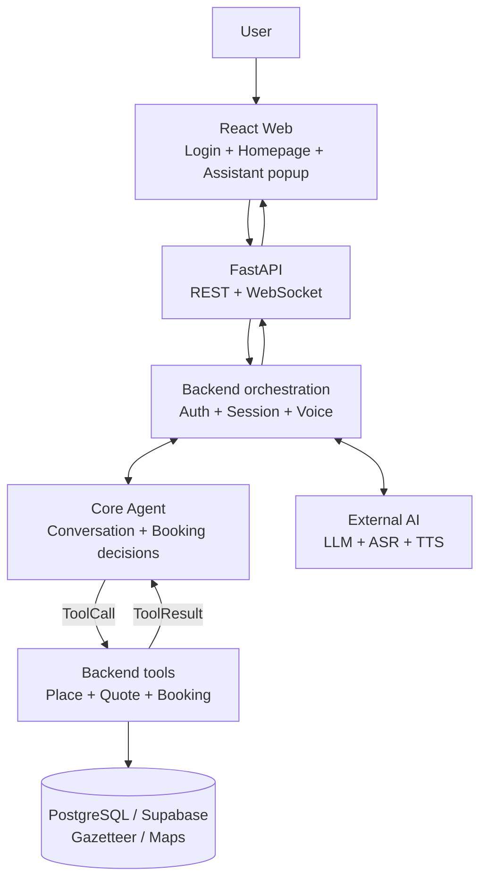
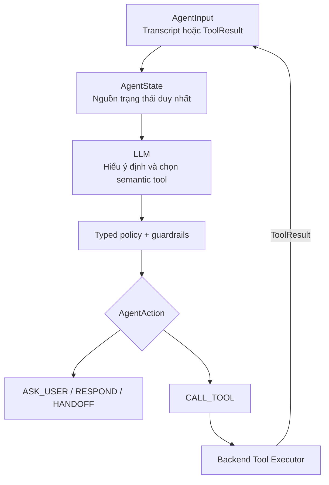
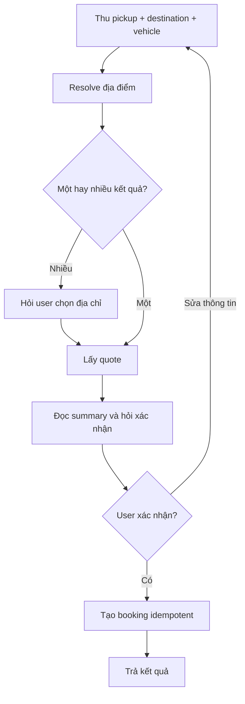
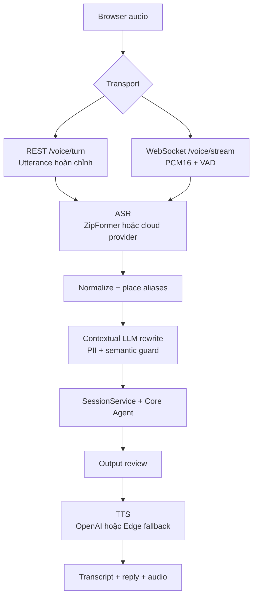

# AloSM MVP Architecture

> Cập nhật: **2026-08-17** · Phạm vi: **Login/Auth** và **Homepage đặt xe bằng text hoặc voice**. Không gồm tracking, history, payment hoặc wallet.

## Tech stack

| Phần | Công nghệ chính |
|---|---|
| Frontend | React 19, TypeScript, Vite, Tailwind CSS, React Router, TanStack Query |
| Backend | Python 3.12, FastAPI, Pydantic, SQLAlchemy, Alembic |
| Agent | Custom model/tool loop, OpenAI-compatible LLM, typed `AgentState`, deterministic guardrails |
| Voice | ZipFormer/OpenAI/Gemini/Groq ASR, contextual LLM rewrite, OpenAI/Edge TTS, FFmpeg |
| Data | PostgreSQL/Supabase; SQLite local; Hà Nội gazetteer và mock VinUni/Hồ Gươm |

## 1. Overall architecture

Nguyên tắc ownership:

- Frontend chỉ hiển thị và thu input.
- Agent quyết định hội thoại nhưng không gọi DB/network.
- Backend thực thi tool, persist state và xác nhận booking.
- Chỉ báo đặt xe thành công sau kết quả Backend.

## 2. Agent architecture

Booking flow:

- User chỉ cần cung cấp **điểm đón, điểm đến, loại xe**.
- VinUni/Hồ Gươm trả nhiều mock candidates nên Agent phải hỏi chọn địa chỉ cụ thể.
- Đổi địa điểm/loại xe sẽ xóa quote và confirmation cũ.

## 3. Voice Gateway architecture

| Lane | Runtime hiện tại |
|---|---|
| REST | ASR auto: ZipFormer → OpenAI → Gemini; OpenAI TTS primary, Edge fallback |
| WebSocket | ZipFormer → Groq ASR; Edge TTS |
| Rewrite | Dùng workflow, bước hiện tại và place candidates; lỗi thì giữ transcript cũ |

Các gap cần xử lý trước production:

- Agent booking vẫn chủ yếu dùng local Hà Nội gazetteer; Maps provider chưa là nguồn duy nhất.
- OpenAI TTS chưa đi qua đầy đủ FFmpeg validation như Edge lane.
- `/voice/speak` chưa enforce auth; WebSocket hiện tạo guest session.
- Supabase migration, RLS, backup/restore và multi-instance test vẫn là release gate.

## Runtime entrypoints

| Phần | File chính |
|---|---|
| Backend | `src/backend/main.py`, `src/backend/services/session_service.py` |
| Agent | `src/agents/agent.py`, `src/agents/core/agent.py` |
| Voice | `src/backend/services/voice_service.py`, `src/voice/gateway.py` |
| Frontend | `src/frontend/src/app/router/index.tsx`, `src/frontend/src/features/ai-assistant/` |

Nguồn đối chiếu: [`PROJECT_SOURCE_OF_TRUTH.md`](PROJECT_SOURCE_OF_TRUTH.md), [`src/agents/README.md`](../src/agents/README.md), [`voice-runtime-architecture.md`](voice-ai/voice-runtime-architecture.md).
