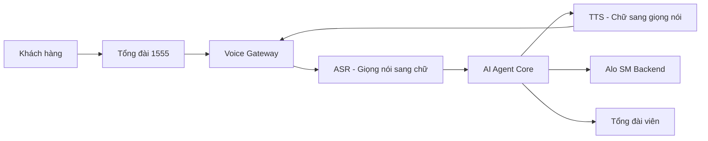
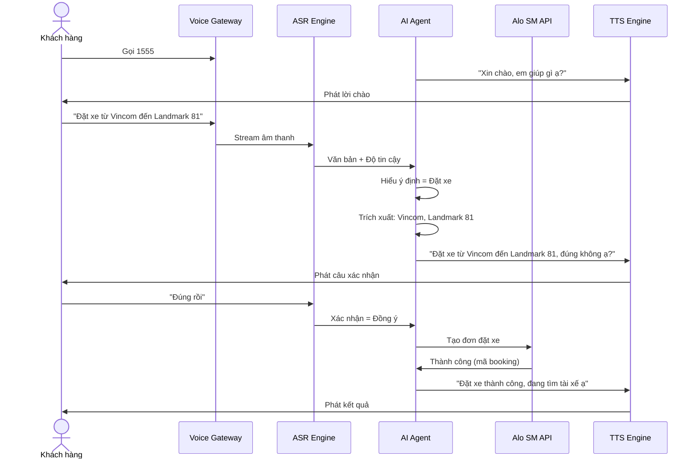
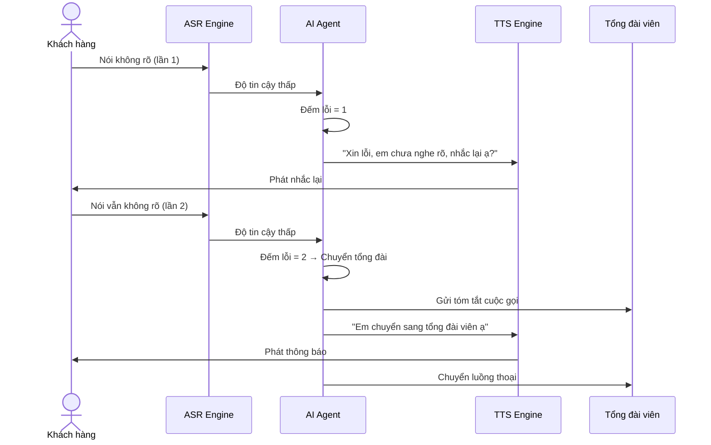
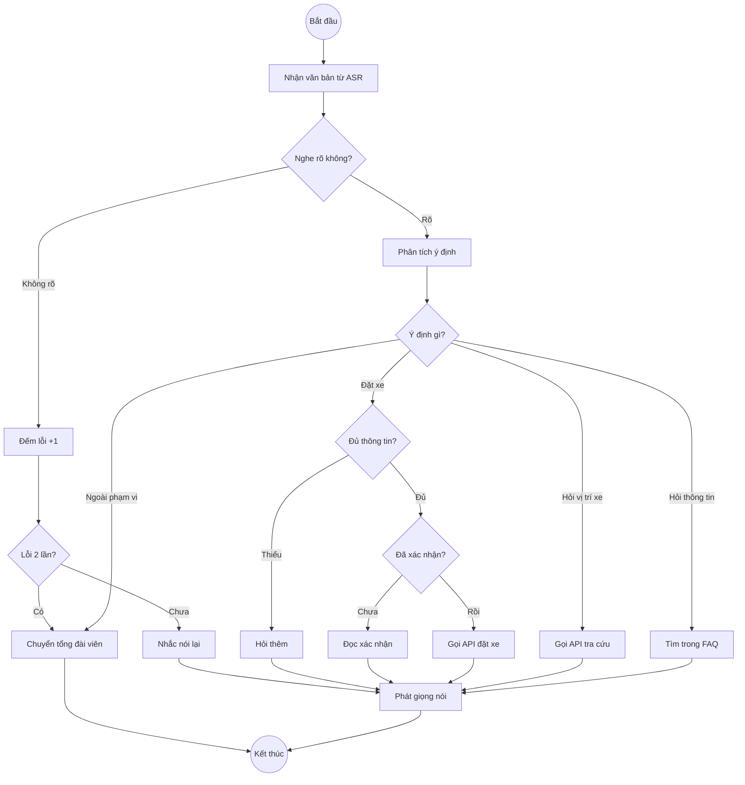
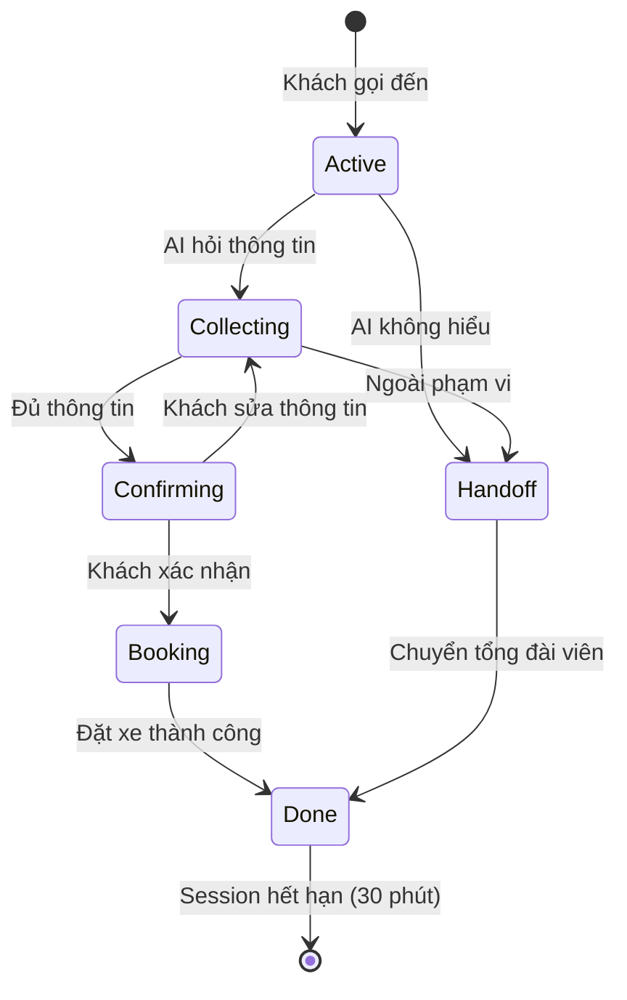
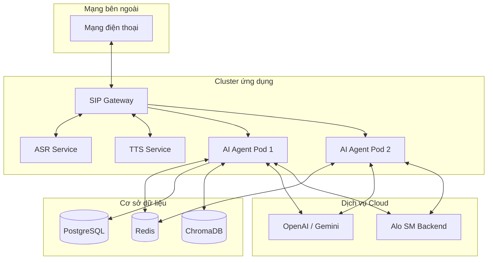

# 🏗️ Technical Architecture — AloSM Voice AI

> **Version:** 1.0 · **PRD:** [PRD_AloSM_Voice.md v0.4](PRD_AloSM_Voice.md) · **Status:** Approved

---

## 1. Tổng quan

AloSM Voice là hệ thống AI xử lý cuộc gọi đặt xe bằng giọng nói tiếng Việt. Khách hàng gọi hotline 1555, AI nghe — hiểu — trả lời — đặt xe. Khi AI không xử lý được, hệ thống tự động chuyển sang tổng đài viên kèm tóm tắt.

**Nguyên tắc kiến trúc:**
- Giọng nói vào → Văn bản → Hiểu ý định → Thực hiện → Giọng nói ra
- Xác nhận bắt buộc trước khi đặt xe (BR-001)
- Chuyển tổng đài viên sau 2 lần nhận diện thất bại (BR-003)
- Không tự suy diễn thông tin khách chưa cung cấp (BR-002)

---

## 2. Kiến trúc tổng quan

Hệ thống gồm 5 tầng chính:



| Tầng | Thành phần | Nhiệm vụ |
|---|---|---|
| **Telephony** | Hotline 1555 + Voice Gateway | Nhận cuộc gọi, truyền âm thanh |
| **Speech** | ASR Engine + TTS Engine | Chuyển giọng nói ↔ văn bản tiếng Việt |
| **AI Core** | FastAPI + LangGraph | Hiểu ý định, quản lý hội thoại, gọi API |
| **Backend** | Alo SM APIs | Đặt xe, tra cứu chuyến, bản đồ |
| **Data** | Redis + PostgreSQL | Lưu session, log cuộc gọi |

---

## 3. Luồng xử lý chính (Happy Path)

Khi khách gọi đặt xe thành công:



---

## 4. Luồng xử lý lỗi (Handoff sang tổng đài viên)

Khi AI không nghe rõ 2 lần liên tiếp:



---

## 5. Luồng xử lý trong AI Agent (LangGraph)

AI Agent hoạt động như một máy trạng thái (State Machine):



---

## 6. Các thành phần chi tiết

### 6.1 Speech Processing (Xử lý giọng nói)

| Thành phần | Công nghệ | Đầu vào | Đầu ra | Xử lý lỗi |
|---|---|---|---|---|
| **ASR** | Whisper / Vietnamese ASR | Âm thanh PCM | Văn bản + Điểm tin cậy | Nhắc nói lại; Handoff sau 2 lần |
| **TTS** | Neural Vietnamese TTS | Văn bản phản hồi | Âm thanh giọng nói | Phát audio tĩnh dự phòng |

### 6.2 AI Tools (Công cụ nghiệp vụ)

| Tool | Đầu vào | Đầu ra | API bên ngoài |
|---|---|---|---|
| **Geocoding** | Tên địa điểm | Tọa độ + Tên đầy đủ | Google Maps / Goong |
| **Booking** | Điểm đón + Điểm đến + SĐT | Mã booking + ETA | Alo SM Booking API |
| **Trip Status** | SĐT khách hàng | Trạng thái xe + Tên tài xế | Alo SM Trip API |
| **FAQ** | Câu hỏi | Câu trả lời từ tài liệu | ChromaDB Vector Store |
| **Handoff** | Tóm tắt cuộc gọi | Trạng thái chuyển | Agent Desktop CRM |

### 6.3 Data Storage (Lưu trữ)

| Thành phần | Công nghệ | Lưu gì | TTL |
|---|---|---|---|
| **Session Cache** | Redis 7.x | Trạng thái hội thoại, bộ đếm lỗi, thông tin đã thu thập | 30 phút sau khi ngắt máy |
| **Database** | PostgreSQL 15 | Log cuộc gọi, transcript mã hóa, audit trail | Theo quy định Legal |
| **Vector Store** | ChromaDB | Embedding FAQ đã duyệt | Cập nhật khi có tài liệu mới |

---

## 7. Session State (Trạng thái phiên hội thoại)

Mỗi cuộc gọi tạo một Session lưu trong Redis:

```json
{
  "call_id": "call-v2-99812",
  "customer_phone": "090*****89",
  "failed_count": 0,
  "intent": "booking",
  "pickup": {"name": "Vincom Đồng Khởi", "lat": 10.77, "lng": 106.70},
  "dropoff": {"name": "Landmark 81", "lat": 10.79, "lng": 106.72},
  "confirmation_status": "confirmed",
  "booking_id": "bk-20260807-9912",
  "handoff_triggered": false
}
```

**Vòng đời Session:**



---

## 8. Xử lý lỗi

| Tình huống | Phát hiện | Xử lý | Phản hồi cho khách |
|---|---|---|---|
| Không nghe rõ (lần 1) | ASR confidence thấp | Đếm lỗi = 1 | "Xin lỗi, em chưa nghe rõ, nhắc lại ạ?" |
| Không nghe rõ (lần 2) | Đếm lỗi = 2 | Chuyển tổng đài viên | "Em chuyển sang tổng đài viên ạ" |
| Địa chỉ mơ hồ | Geocoding trả > 1 kết quả | Hỏi khách chọn | "Có 2 Vincom, anh/chị muốn đến Vincom nào ạ?" |
| API đặt xe lỗi | HTTP 5xx hoặc timeout | Chuyển tổng đài viên | "Hệ thống bận, em chuyển tổng đài viên ạ" |
| Không tìm thấy xe | API trả NO_DRIVER | Thông báo | "Chưa tìm được xe, thử lại sau ạ?" |
| Đặt xe trùng | Redis Idempotency Key | Chặn trùng | "Anh/chị đã có chuyến xe đang chờ" |
| Câu hỏi ngoài phạm vi | NLU intent = out_of_scope | Chuyển tổng đài viên | "Em chuyển sang tổng đài viên ạ" |
| FAQ không có câu trả lời | Vector search không khớp | Thông báo rõ | "Chưa có thông tin, em chuyển tổng đài viên ạ?" |

---

## 9. Bảo mật & Riêng tư

| Yêu cầu | Giải pháp |
|---|---|
| Mã hóa SĐT và địa chỉ | AES-256 khi lưu; TLS 1.2+ khi truyền |
| Che SĐT trong log | Hiển thị dạng `090*****89` |
| Bảo vệ file ghi âm | Mã hóa at-rest; tự hủy sau 30 ngày |
| Xác thực API | OAuth2 Bearer Token / mTLS |
| Chống đặt xe trùng | Idempotency Key trên mỗi request |
| Chống spam | Giới hạn 3 cuộc gọi đồng thời / SĐT |

---

## 10. Triển khai



---

## 11. Công nghệ sử dụng

| Thành phần | Công nghệ | Lý do chọn |
|---|---|---|
| Điều phối AI | LangGraph + LangChain | Quản lý hội thoại đa nhánh, có vòng lặp |
| Backend | FastAPI (Python 3.11) | Async, hiệu năng cao cho voice realtime |
| LLM | GPT-4o-mini / Gemini | Hiểu tiếng Việt tốt, phản hồi nhanh |
| ASR | Whisper / Vietnamese ASR | Nhận diện tiếng Việt kèm confidence score |
| TTS | Neural Vietnamese TTS | Giọng đọc tự nhiên, hỗ trợ streaming |
| Session | Redis 7.x | Truy xuất nhanh (< 5ms) |
| Database | PostgreSQL 15 | Lưu trữ log và audit ổn định |
| Vector DB | ChromaDB | Lưu embedding FAQ cho RAG |
| Container | Docker + Docker Compose | Nhất quán giữa Dev và Production |

---

## 12. Đối chiếu với PRD

| Feature trong PRD | Thành phần kiến trúc tương ứng |
|---|---|
| **F1 — Đặt xe bằng giọng nói** | ASR Engine → NLU Node → Session Memory (Redis) → Geocoding Tool → Confirmation Node → Booking Tool → Alo SM API |
| **F2 — Chuyển tổng đài viên** | Handoff Trigger → Context Summary → SIP REFER → Agent Desktop |
| **F3 — Tra cứu chuyến xe** | Trip Status Tool → Alo SM Trip API → TTS phản hồi |
| **F4 — FAQ** | FAQ Tool → ChromaDB Vector Search → TTS phản hồi |

---

## 13. Giám sát & Cảnh báo

| Chỉ số | Mục tiêu | Cảnh báo khi |
|---|---|---|
| Độ trễ end-to-end (p95) | ≤ 2.5 giây | > 4 giây trong 5 phút |
| ASR confidence trung bình | ≥ 0.85 | < 0.70 trong 5 phút |
| Tỷ lệ đặt xe thành công | ≥ 80% | < 70% |
| Tỷ lệ tự động hóa | ≥ 65% | < 50% |
| Lỗi Booking API | < 1% | > 5% trong 3 phút |

---

## 14. Quyết định kiến trúc quan trọng

| Quyết định | Lý do |
|---|---|
| **Dùng LangGraph** thay vì Sequential Chain | Đặt xe cần vòng lặp (hỏi lại, sửa thông tin) mà Sequential Chain không hỗ trợ |
| **Bắt buộc xác nhận** trước khi đặt xe | Đặt xe phát sinh chi phí thực; giảm rủi ro ASR nhận diện sai |
| **Rule-based + LLM** kết hợp | Business Rules quan trọng (Handoff, duplicate) phải chính xác 100%; LLM cho NLU linh hoạt |
| **Session lưu Redis** thay vì trong bộ nhớ | Cho phép scale nhiều Pod mà không mất state |
