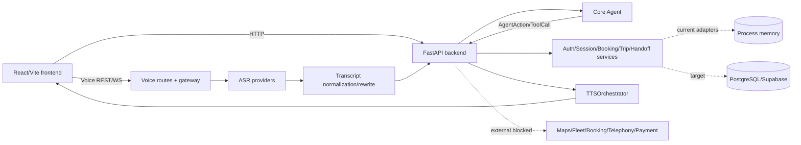

# Technical architecture — AloSM Voice

Cập nhật: **2026-08-16** · Trạng thái: `CURRENT`.

## Runtime hiện hành



Entrypoint là `src/main.py` → `src/backend/main.py`. Frontend chỉ gọi Backend;
Core Agent không gọi external API/DB và không tạo side effect.

## Boundary

| Thành phần | Sở hữu | Không sở hữu |
|---|---|---|
| Frontend | UI state, playback, user interaction | Fare/voucher rule, booking truth |
| Backend | Auth/session, orchestration, tool execution, idempotency | Tự bịa provider result |
| Core Agent | Typed state, semantic action, confirmation policy | HTTP/DB/TTS/booking side effect |
| Voice | Audio/ASR/rewrite/TTS transport và quality gate | Business state riêng |
| Provider adapters | Place/route/fleet/booking/telephony result | Conversation policy |

## Luồng booking

```text
Auth -> Session -> ASR/text -> AgentState
-> resolve pickup/destination
-> route/fleet/quote/promotion
-> explicit confirmation
-> idempotent create_booking
-> provider result
-> reviewed TTS hoặc handoff
```

Free-form location không được coi là resolved. Sửa location/vehicle làm vô hiệu
quote và confirmation cũ. Booking chỉ được công bố thành công sau Backend result.

## Persistence truth

SQLAlchemy models và Alembic migrations đã có cho user/token/session/booking/trip/
handoff/call/event. Các service chính vẫn dùng process-memory; vì vậy hiện là
`DEMO/STAGING_ONLY`, chưa đạt restart/multi-instance durability. Thiết kế và cách
migrate nằm tại [`database_supabase.md`](database_supabase.md).

## Voice

Voice có ba transport trên một pipeline chung: `/voice/turn`, `/voice/speak` và
`/voice/stream`. Chi tiết tại
[`voice-ai/voice-runtime-architecture.md`](voice-ai/voice-runtime-architecture.md).

## Security và operations

- Secret chỉ ở `.env` local/secret manager.
- PII phải mask/redact trong LLM request, TTS output và log công khai.
- Booking/tool call cần correlation và idempotency.
- Health/metrics không thay readiness của provider business.
- Production cần RBAC, retention, audit, backup/restore, load/soak và DR.

## Trạng thái

Source of truth và roadmap: [`PROJECT_SOURCE_OF_TRUTH.md`](PROJECT_SOURCE_OF_TRUTH.md).
External blockers: [`../mustdo.md`](../mustdo.md). Data contracts:
[`../src/agents/DATAFINDING.md`](../src/agents/DATAFINDING.md).
