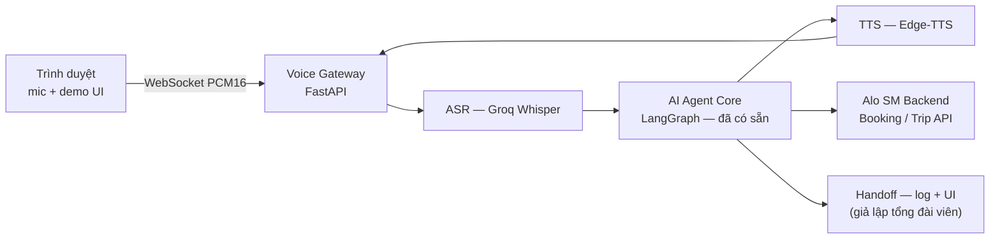
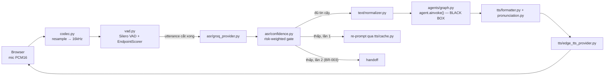

# Voice AI — Tổng hợp (Capstone + Deploy)

> ⚠️ **Đã tích hợp vào project thật (2026-08-12)** — một số quyết định kiến trúc bên
> dưới (D6 Redis session store, gọi Core Agent qua `agent_bridge.py`/LangGraph) đã
> **thay đổi** khi tích hợp thật vào nhánh có Backend/Frontend/Agentic của team, vì
> Backend đã có sẵn dialogue engine riêng (`SessionService`) đang chạy thật — Voice
> dùng thẳng engine đó thay vì tự dựng state machine + Redis riêng. Xem
> [prompt_voice_integration_real_be_fe.md](prompt_voice_integration_real_be_fe.md)
> cho kiến trúc **thật đang chạy** và [mustdo_voice.md](mustdo_voice.md) cho việc còn
> lại. File này giữ nguyên làm tài liệu bối cảnh/lịch sử quyết định ban đầu.

**Vai trò tài liệu:** Bản tổng hợp duy nhất cho phần Voice AI — bối cảnh, kiến trúc, tech stack đã chốt, cấu trúc module, chia việc cho 4 người, nguyên tắc làm việc nhóm, rủi ro.
**Tài liệu việc cần làm (chi tiết từng task/branch):** [voice_todo_list.md](voice_todo_list.md).
**Tham khảo gốc — không sửa, thuộc phạm vi chung của team:** [PRD_AloSM_Voice.md](PRD_AloSM_Voice.md) v0.4 · [architecture_diagram.md](architecture_diagram.md) v1.0 · [interface_design.md](interface_design.md) v0.1.
**Thay thế cho:** `voice_student_project_plan.md`, `voice_6week_plan.md`, `voice_implementation_plan.md`, `voice_skeleton_workflow_todo.md` (đã gộp nội dung vào đây + `voice_todo_list.md`, không dùng các file cũ nữa).
**Cập nhật:** 2026-08-10

---

## 1. Bối cảnh & mục tiêu

**Đây là bài tập lớn (capstone/final project), không phải sản phẩm thương mại.**
Mục tiêu thực sự: demo được kịch bản đặt xe bằng giọng nói qua **trình duyệt** → thầy/hội đồng chấm điểm.
Ngân sách: gần như $0 — chỉ dùng API free tier và thư viện open-source.
Đội hình: **4 người** cùng làm phần Voice AI, chia thành **8 phần công việc** (§5).

### Dự án này: Capstone + Deploy thật

| Tiêu chí | Production đầy đủ | Phạm vi dự án này |
|---|---|---|
| SLA & uptime | 99.9% — phải monitor 24/7 | Demo + deploy chạy được — uptime best-effort |
| Kênh gọi vào | CPaaS (Twilio/Stringee) — số điện thoại thật | **Trình duyệt** — mic + WebSocket, không cần điện thoại |
| PII/Legal compliance | Bắt buộc sign-off Legal trước khi thu âm | Không áp dụng — không thu dữ liệu người dùng thật |
| Benchmark ASR/TTS | 50–800 câu, so sánh nhiều provider | Test tay 10–15 câu là đủ |
| Session store | Redis (multi-worker) | **Redis** — dùng Redis và session bền vững, phù hợp deploy thật |
| ASR/TTS provider | Chuẩn bị 3 phương án mỗi loại để so sánh | Chọn thẳng 1 provider tốt nhất, build luôn |
| Barge-in (ngắt lời AI) | Bắt buộc theo NFR | Bỏ — phức tạp, không critical cho demo |
| CI/CD | GitHub Actions (CI test + CD deploy auto) | **GitHub Actions CI** (test/lint mọi PR vào `feature/voice-ai`) + **CD** (auto deploy lên PaaS khi merge `develop` → `main`) |


---

## 2. Phạm vi sản phẩm (tóm tắt từ PRD — không sửa PRD gốc)

| Feature | Mức ưu tiên | Mô tả ngắn |
|---|---|---|
| **F1 — Đặt xe bằng giọng nói** | Must | Nghe điểm đón/đến → xác nhận bắt buộc → gọi Booking API |
| **F2 — Chuyển tổng đài viên (Handoff)** | Must | ASR thất bại 2 lần liên tiếp hoặc ngoài phạm vi → chuyển kèm tóm tắt (giả lập UI + log cho demo) |
| **F3 — Tra cứu chuyến xe** | Must | Hỏi trạng thái xe hiện tại → trả lời bằng giọng nói |
| **F4 — FAQ** | Should | Trả lời câu hỏi thông tin dịch vụ từ tài liệu |

**Business rules cần giữ đúng khi code:**
- **BR-001** — Bắt buộc xác nhận bằng lời nói trước khi gọi Booking API.
- **BR-002** — Không tự suy diễn thông tin khách chưa cung cấp.
- **BR-003** — ASR thất bại 2 lần liên tiếp → chuyển tổng đài viên (handoff).

**Chỉ tiêu mục tiêu (pilot):** tỷ lệ hoàn thành đặt xe ≥ 80%, tỷ lệ tự động hoá không lỗi ≥ 65%, độ trễ voice-to-voice p95 ≤ 2.5 giây.

---

## 3. Kiến trúc & tech stack đã chốt

Kiến trúc rút gọn: **một service FastAPI duy nhất**, không tách microservice, không hạ tầng ngoài.



### Quyết định kỹ thuật — đã khoá, không benchmark trước khi code

| # | Quyết định | Đã chốt | Vì sao |
|---|---|---|---|
| D1 | ASR provider | **Groq Whisper API** (`whisper-large-v3-turbo`) | Miễn phí, ~200–400ms, không cần GPU |
| D2 | TTS provider | **Edge-TTS** (`vi-VN-HoaiMyNeural`) | Miễn phí, giọng tiếng Việt tự nhiên, streaming tốt |
| D3 | Endpoint detection | **Ngưỡng im lặng cố định 900ms** | Đơn giản, đủ tốt; hiệu chỉnh bằng test tay ở Tuần 5 |
| D4 | VAD library | **Silero VAD (ONNX)** | MIT license, ~2MB, chạy CPU, offline |
| D5 | Kênh gọi vào | **Browser WebSocket** (không CPaaS) | Deploy lên PaaS (Render/Railway/Fly.io) — HTTPS tự động, mic hoạt động trên HTTPS |
| D6 | Session store | **Redis** (free tier Upstash hoặc Redis add-on của PaaS) | Deploy thật cần session bền vững; Upstash Redis free tier là đủ cho quy mô demo |
| D7 | CI/CD | **GitHub Actions** (CI: test/lint mọi PR vào `feature/voice-ai`; CD: deploy auto khi `feature/voice-ai` → `develop` → `main`) | Đã có `ci.yml` — mở rộng thêm CD step |


### Pipeline kỹ thuật



**Không build:** CPaaS/telephony bridge, μ-law codec, barge-in, PostgreSQL, đa provider ASR/TTS.

---

## 4. Cấu trúc thư mục & module

```
src/
├── voice/
│   ├── gateway.py                  # Entry point WS, điều phối pipeline        → Phần 2
│   ├── session.py                  # VoiceSession + state machine (Redis)        → Phần 2
│   │
│   ├── audio/
│   │   ├── codec.py                # Resample PCM16 (browser → 16kHz)          → Phần 1
│   │   └── vad.py                  # Silero VAD + EndpointScorer                → Phần 1
│   │
│   ├── asr/
│   │   ├── base.py                 # ASRProvider contract                       → Phần 3
│   │   ├── groq_provider.py        # Groq Whisper API                          → Phần 3
│   │   ├── confidence.py           # Risk-weighted confidence gate              → Phần 3
│   │   └── biasing.py              # Contextual biasing địa danh                → Phần 4
│   │
│   ├── tts/
│   │   ├── base.py                 # TTSProvider contract                       → Phần 5
│   │   ├── edge_tts_provider.py    # Edge-TTS                                   → Phần 5
│   │   ├── formatter.py            # Spoken-language formatter                  → Phần 6
│   │   ├── pronunciation.py        # Override phát âm                           → Phần 6
│   │   └── cache.py                # Cache audio câu tĩnh                       → Phần 6
│   │
│   └── text/
│       ├── normalizer.py           # raw_transcript → normalized_transcript     → Phần 4
│       └── gazetteer.py            # Bảng địa danh dùng chung                    → Phần 4
│
├── models/voice_schemas.py         # ASRResult, TTSResult, VoiceTurnState...    → nền tảng chung (Phần 2 giữ)
├── api/voice_routes.py             # WebSocket + REST routes                    → Phần 7
└── config.py                       # Block settings voice                       → Phần 2

demo/                                # Trang demo browser
├── index.html                      # Nút Gọi, transcript, audio playback        → Phần 7
└── demo.js                         # WebSocket client, mic capture              → Phần 7

tests/test_voice/
├── fake_providers.py                # FakeASR/FakeTTS cho CI                    → Phần 8
└── test_*.py                        # Unit test từng module                     → Phần 8 (+ người của module đó)
```

---

## 5. Chia 8 phần công việc cho 4 người

> 4 người × 2 phần/người. Mỗi người sở hữu 1 phần "core" + 1 phần "quality/support" liên quan — tránh việc ai cũng đụng vào cùng file, giảm conflict PR.

| Người | Phần sở hữu | Chủ đề |
|---|---|---|
| **Người 1** | Phần 1 + Phần 2 | Audio & Voice Infra (VAD, Session, Gateway) |
| **Người 2** | Phần 3 + Phần 4 | ASR (nghe hiểu + chất lượng địa danh) |
| **Người 3** | Phần 5 + Phần 6 | TTS (nói + chất lượng phát âm) |
| **Người 4** | Phần 7 + Phần 8 | Giao diện demo + Testing/QA |

*(Điền tên thật vào bảng trên khi phân công.)*

### Phần 1 — Audio Pipeline & VAD
- **Module:** `audio/codec.py`, `audio/vad.py`
- **Việc:** Resample PCM16 từ browser (48kHz) → 16kHz; tích hợp Silero VAD; `EndpointScorer` ngưỡng 900ms cố định.
- **Phụ thuộc:** Không phụ thuộc ai — làm được ngay Tuần 1.
- **Tuần chính:** 1–2.

### Phần 2 — Session & Gateway
- **Module:** `voice/session.py`, `voice/gateway.py`, `config.py` (block voice), `models/voice_schemas.py`
- **Việc:** Định nghĩa schema (`ASRResult`, `TTSResult`, `VoiceTurnState`, `HandoffReason`); state machine `VoiceSession` (**Redis** — Upstash free tier); nối toàn bộ pipeline trong `gateway.py` sau khi các phần khác có provider.
- **Phụ thuộc:** Schema xong trước để Phần 3/5 code theo contract. `gateway.py` chờ Phần 1, 3, 5 xong (Tuần 2) mới nối được.
- **Tuần chính:** 1 (schema/config), 2 (session Redis), 3 (gateway — mốc quan trọng nhất).

### Phần 3 — ASR Core
- **Module:** `asr/base.py`, `asr/groq_provider.py`, `asr/confidence.py`
- **Việc:** Contract `ASRProvider`; tích hợp Groq Whisper API streaming; confidence gate (ngưỡng thường 0.60, ngưỡng xác nhận đặt xe 0.80 theo BR-001).
- **Phụ thuộc:** Schema từ Phần 2.
- **Tuần chính:** 1 (contract), 2 (provider + confidence).

### Phần 4 — ASR Quality (Địa danh & chuẩn hoá văn bản)
- **Module:** `text/gazetteer.py`, `asr/biasing.py`, `text/normalizer.py`, `data/gazetteer/place_names.json`
- **Việc:** Danh sách địa danh AloSM thật (Vincom Đồng Khởi, Landmark 81...); load gazetteer dùng chung; chèn địa danh vào prompt Groq + fuzzy correction; chuẩn hoá số/tiền tệ trong transcript.
- **Phụ thuộc:** Phối hợp với Phần 3 (biasing cắm vào `groq_provider.py`) và Phần 6 (gazetteer dùng chung cho pronunciation TTS).
- **Tuần chính:** 1 (gazetteer data), 2 (normalizer), 4 (biasing — cải thiện chất lượng).

### Phần 5 — TTS Core
- **Module:** `tts/base.py`, `tts/edge_tts_provider.py`
- **Việc:** Contract `TTSProvider`; tích hợp Edge-TTS streaming theo câu, giọng `vi-VN-HoaiMyNeural`, tốc độ 0.9 (persona người lớn tuổi).
- **Phụ thuộc:** Schema từ Phần 2.
- **Tuần chính:** 1 (contract), 2 (provider).

### Phần 6 — TTS Quality (Phát âm & cache)
- **Module:** `tts/formatter.py`, `tts/pronunciation.py`, `tts/cache.py`
- **Việc:** Số → chữ, tiền tệ, đơn vị cho câu xác nhận đặt xe; override phát âm tên riêng (AloSM, Landmark 81) dùng chung gazetteer từ Phần 4; pre-render audio câu tĩnh (chào, xin lỗi, handoff).
- **Phụ thuộc:** Gazetteer từ Phần 4; provider từ Phần 5.
- **Tuần chính:** 2 (formatter), 4 (pronunciation + cache).

### Phần 7 — API Routes & Demo UI
- **Module:** `api/voice_routes.py`, `demo/index.html`, `demo/demo.js`
- **Việc:** WebSocket route `/v1/voice/stream` + REST endpoints; trang demo browser — nút "Gọi"/"Kết thúc", hiển thị trạng thái (🎙️ Đang nghe / ⚙️ Đang xử lý / 🔊 AI đang nói), transcript realtime, phát audio trả về.
- **Acceptance criteria Demo UI:**
  - **Production:** chạy qua **HTTPS** trên PaaS (Render/Railway/Fly.io) — HTTPS tự động, mic hoạt động không cần thêm cấu hình.
  - **Local dev:** `http://localhost` vẫn được (Chrome cho phép mic trên localhost không cần HTTPS).
  - Trình duyệt: Chrome/Edge (Chromium-based); không bắt buộc Firefox/Safari.
  - Không cần responsive/mobile; không cần reload trang giữa các lượt gọi.
- **Phụ thuộc:** Chờ `gateway.py` (Phần 2) sẵn sàng.
- **Tuần chính:** 3 (mốc quan trọng nhất — cuối tuần này phải demo được), 6 (polish UI).

### Phần 8 — Testing, QA & Demo Prep
- **Module:** `tests/test_voice/`, tài liệu QA, README
- **Việc:** `FakeASRProvider`/`FakeTTSProvider` cho CI (Tuần 1, chặn các phần khác code mà không cần API thật); unit test từng module cùng người phụ trách module đó; test E2E, đo latency, tuning threshold; chuẩn bị 3 kịch bản demo; viết README hướng dẫn chạy.
- **Phụ thuộc:** Fake providers cần xong sớm (Tuần 1) vì mọi module khác dùng để test không cần gọi API thật.
- **Tuần chính:** 1 (fake providers), 5 (QA), 6 (demo prep).

---

## 6. Phương án kỹ thuật đã chốt cho từng phần

> Đã loại bỏ bảng so sánh 3 phương án — chọn thẳng 1 phương án tốt nhất cho mỗi phần. Không cần kiểm chứng thêm trước khi code.

### Phần 1 — Audio Pipeline & VAD
**Chốt: Silero VAD (ONNX)**
- MIT license, ~2 MB, chạy CPU ~1–3 ms/chunk, không cần GPU, offline hoàn toàn.
- `onnxruntime` là dependency duy nhất — nhỏ gọn, đáng chấp nhận.
- Chính xác tốt kể cả có nhiễu nhẹ (quạt, nhạc nhỏ) — phù hợp môi trường demo.
- `audio/codec.py` (resample PCM16 48 kHz → 16 kHz) nằm chung branch này (S0-5).

### Phần 2 — Session & Gateway
**Chốt: Redis** (Upstash free tier hoặc Redis add-on của PaaS)
- Session bền vững qua restart, phù hợp deploy thật.
- Upstash Redis free tier (10 MB, 10 k req/ngày) là đủ cho quy mô demo + review.
- Fallback: nếu Redis không available trong `APP_ENV=test` → dùng dict tạm (test-only).

### Phần 3 — ASR Core
**Chốt: Groq Whisper API** (`whisper-large-v3-turbo`)
- Miễn phí (có rate limit), ~200–400 ms, không cần hạ tầng riêng.
- Sai sót địa danh được bù bởi Phần 4 (biasing + fuzzy correction).

### Phần 4 — ASR Quality (địa danh & chuẩn hoá)
**Chốt: Kết hợp Prompt-conditioning + Fuzzy correction**
- Prompt-conditioning: chèn danh sách địa danh vào Groq prompt — đơn giản, chi phí 0.
- Fuzzy correction (`rapidfuzz`): bắt lỗi địa danh dễ sai ("Vin Côm" → "Vincom") — dễ viết unit test, kiểm soát được.
- Hai cách không loại trừ nhau — kết hợp tăng độ chính xác tổng thể.

### Phần 5 — TTS Core
**Chốt: Edge-TTS** (`vi-VN-HoaiMyNeural`, tốc độ 0.9)
- Miễn phí, TTFA ~100–250 ms, streaming theo câu tốt.
- Giọng tự nhiên nhất trong các option miễn phí cho tiếng Việt.
- Rủi ro API không chính thức được giảm thiểu bởi `tts/cache.py` (Phần 6 pre-render câu tĩnh).

### Phần 6 — TTS Quality (phát âm & cache)
**Chốt: Text substitution dictionary**
- Thay chữ trước khi đưa vào TTS — đơn giản, không phụ thuộc tính năng SSML của provider.
- Dễ thêm/sửa từng từ (AloSM → "Alo Ét Em", Landmark 81 → "Len Mác Tám Mươi Mốt").
- Pre-render câu tĩnh (chào, xin lỗi, handoff) từ `tts/cache.py` để giảm phụ thuộc Edge-TTS.

### Phần 7 — API Routes & Demo UI
**Chốt: WebSocket streaming nhị phân** (endpoint `/v1/voice/stream`)
- Độ trễ thấp nhất, dễ mở rộng sự kiện (status, transcript, audio chunk).
- Đã chốt từ D5 — không cần xém lại.

**Demo UI — acceptance criteria đã chốt:**
- Chạy qua **HTTPS** trên PaaS (Render/Railway/Fly.io) — HTTPS tự động, không cần cấu hình thủ công.
- Local dev: `http://localhost` vẫn được (Chrome cho phép mic trên localhost không cần HTTPS).
- Trình duyệt: **Chrome / Edge** (Chromium-based) — không bắt buộc Firefox / Safari.
- Không cần responsive / mobile — tối ưu cho laptop khi trình chiếu.
- Microphone: **bắt buộc HTTPS** khi deploy thật — PaaS cung cấp sẵn, không cần tự setup cert.

### Phần 8 — Testing, QA & Demo Prep
**Chốt: GitHub Actions CI + Test tay có ghi log số liệu**
- **CI (tự động):** Mọi PR vào `feature/voice-ai` chạy `ruff check` + `pytest tests/test_voice/` dùng FakeASR/FakeTTS — không gọi API thật.
- **CD (tự động):** `feature/voice-ai` → `develop` → `main` trigger deploy lên PaaS. Đã có `ci.yml` — mở rộng thêm `deploy` job.
- **QA thủ công:** 10–15 câu mẫu cố định, chạy qua từng ngưỡng (confidence/VAD), ghi tỷ lệ đúng vào bảng.

---

## 7. Nguyên tắc làm việc nhóm

### Git flow

Hierarchy nhanh (cao → thấp):

```
main              ← release-able, deploy production
  └ develop       ← tích hợp chung toàn project
      └ feature/voice-ai   ← nhánh gốc Voice AI (Voice lead quản lý)
          ├ feature/voice-define-data-schemas
          ├ feature/voice-implement-vad-silero
          ├ feature/voice-integrate-asr-groq
          └ ... (tất cả 19 task branches)
```

> **G1** chỉ dùng để báo cáo tiến độ — không phải nhánh làm việc.

```bash
# Lấy nhánh gốc Voice AI
git checkout feature/voice-ai && git pull origin feature/voice-ai
git checkout -b feature/voice-<mô-tả>
git push -u origin feature/voice-<mô-tả>
git fetch origin && git rebase origin/feature/voice-ai   # sync khi đang làm
```

### Definition of Done cho mỗi module
- [ ] Implement đúng interface `asr/base.py` / `tts/base.py` — không tự ý đổi signature.
- [ ] Unit test dùng **fake provider** (Phần 8), không gọi API thật trong CI.
- [ ] Không log raw audio hoặc SĐT/địa chỉ chưa mask.
- [ ] Cập nhật `config.py` nếu thêm biến môi trường mới — không hardcode threshold.
- [ ] Nếu đổi/thêm WS event → cập nhật bảng schema trước khi merge.

### Review checklist (mọi PR chạm voice layer)
- Đúng contract `ASRResult`/`TTSResult` (field không đổi tên)?
- Không sửa `src/agents/` trừ khi PR giải thích rõ lý do?
- Threshold nào đang hardcode mà lẽ ra phải nằm trong `config.py`?
- PII (SĐT, địa chỉ) có xuất hiện trong log/test fixture không?

### Nguyên tắc test-double
Mọi CI test không được gọi Groq hay Edge-TTS thật — dùng `FakeASRProvider`/`FakeTTSProvider` (Phần 8) trả dữ liệu giả cố định.

---

## 8. Lịch trình 6 tuần (tóm tắt)

| Tuần | Mục tiêu | Phần hoạt động chính |
|---|---|---|
| 1 — Foundation | Schemas, contracts, VAD, config, fake providers, gazetteer data | Tất cả — song song hoàn toàn |
| 2 — Core Build | Groq ASR, Edge-TTS, session (Redis), normalizer, formatter, confidence | Phần 1, 2, 3, 4 (normalizer), 5, 6 (formatter) |
| 3 — Gateway & UI ⭐ | **Mốc quan trọng nhất:** mở browser → nói → nghe AI trả lời | Phần 2 (gateway), Phần 7 (routes + UI) |
| 4 — Quality | Biasing địa danh, pronunciation, TTS cache | Phần 4, Phần 6 |
| 5 — QA + Deploy | Test E2E, đo latency, tuning threshold, **CI/CD pipeline hoàn chỉnh** | Phần 8 (+ cả team) |
| 6 — Demo Prep | Polish UI, kịch bản demo, README, deploy lên PaaS để hội đồng review | Phần 7, Phần 8 |

Danh sách branch/PR/người nhận cụ thể theo từng tuần: **[voice_todo_list.md](voice_todo_list.md)**.

---

## 9. Rủi ro & việc không làm

### Rủi ro còn lại

| Rủi ro | Mức độ | Giảm thiểu |
|---|---|---|
| Groq rate limit khi nhiều người test cùng lúc (đặc biệt lúc demo) | 🟡 Trung bình | Implement retry; cache câu phổ biến (Phần 6); test tải nhẹ trước buổi demo |
| Edge-TTS bị chặn hoặc đổi API (không chính thức) | 🟡 Trung bình | Có sẵn fallback câu tĩnh từ `tts/cache.py`; test lại ngay trước demo |
| Latency > 2.5s do cold start Groq/mạng chậm | 🟡 Trung bình | Pre-warm request khi mở WebSocket; đo sớm ở Tuần 4 để có thời gian fix |
| Trình duyệt hội đồng chấm chặn quyền micro | 🟢 Thấp | Test trước trên Chrome/Edge; hướng dẫn rõ trong README/kịch bản demo |
| 4 người code cùng lúc gây conflict trên `gateway.py`/`voice_schemas.py` | 🟡 Trung bình | Chốt schema (Phần 2) xong Tuần 1 trước khi Phần 3/5 code theo; `gateway.py` chỉ 1 người (Phần 2) sửa |
| Edge-TTS streaming ngắt giữa câu dài (tên địa danh phức tạp) | 🟡 Trung bình | Giới hạn độ dài câu TTS ≤ 80 ký tự; ghép nhiều câu ngắn; fallback `tts/cache.py` |
| Browser mic permission tự reset giữa các lượt gọi (Chrome) | 🟢 Thấp | Test flow đầy đủ trước demo; ghi bước allow mic trong README; tránh reload trang |
| PaaS cold start (Render free tier ngủ sau 15 phút không có request) | 🟡 Trung bình | Dùng Railway / Fly.io (không có sleep); hoặc ping server trước buổi demo |
| Redis Upstash free tier vượt giới hạn req trong buổi demo tải cao | 🟢 Thấp | 10k req/ngày là đủ; fallback về in-memory dict tạm thời nếu vượt |
| CD deploy fail giữa buổi review | 🟢 Thấp | Freeze deploy 24h trước buổi chấm; kiểm tra health endpoint sau mọi deploy |

### Việc chưa nên làm (ngoài phạm vi dự án này)

- CPaaS/telephony thật (Twilio/Stringee), μ-law codec, SIP Gateway
- Barge-in (ngắt lời AI đang nói)
- PostgreSQL, đa provider ASR/TTS, benchmark 50–800 câu
- Fine-tune ASR/TTS, voice cloning thương hiệu riêng
- Full-duplex thật, wake-word/always-listening
- Tự host mô hình trên GPU riêng
- Dashboard observability, vòng lặp active learning, Legal/DPO sign-off

---

*Tài liệu này do Voice AI lead duy trì. Gộp từ `voice_student_project_plan.md`, `voice_6week_plan.md`, `voice_implementation_plan.md`, `voice_skeleton_workflow_todo.md` (2026-08-10) — các file cũ không còn dùng.*

