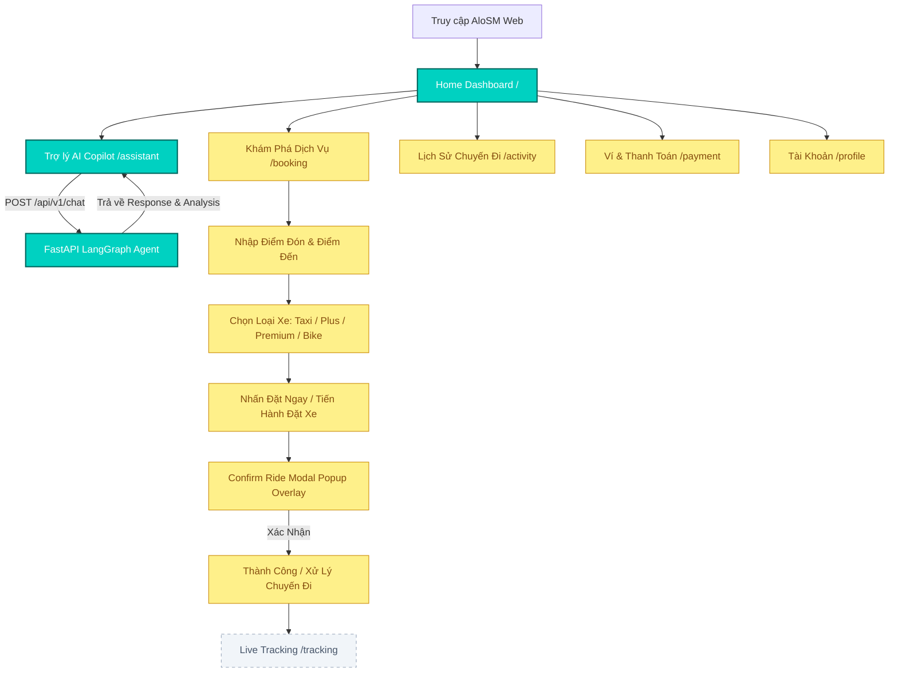

# AloSM Web — End-to-End User Flow Documentation

Sơ đồ thể hiện luồng người dùng End-to-End từ truy cập ứng dụng đến hoàn thành chuyến đi và xem lịch sử.

## Luồng Chi Tiết Theo Màn Hình

### 1. Home Dashboard (`/`) `[IMPLEMENTED & PARTIAL]`
- Người dùng xem thông tin tổng quan, chào mừng cá nhân hóa, gợi ý AI Assistant và danh mục dịch vụ nhanh.

### 2. AI Assistant (`/assistant`) `[IMPLEMENTED]`
- Tương tác thoại (Mic Visualizer UI) hoặc nhập câu hỏi văn bản.
- Gọi trực tiếp tới backend `POST /api/v1/chat`.
- Nhận phản hồi câu trả lời + thông tin suy luận từ LangGraph Agent.

### 3. Booking & Service Selection (`/booking`) `[MOCK DATA & UI ONLY]`
- Chọn điểm đón / điểm đến.
- Lựa chọn giữa các loại xe: AloSM Taxi, AloSM Plus, AloSM Premium, AloSM Bike, AloSM Express.
- Nhấn "Đặt Ngay" để mở **Confirm Ride Modal** (bản đồ mờ nền, ví AloSM Pay, thông số xe và cước phí).

### 4. Live Tracking (`/tracking`) `[BACKEND INTEGRATION PENDING]`
- Sau khi xác nhận đặt xe, chuyển hướng tới màn hình Theo dõi hành trình trực tiếp.
- Hiển thị vị trí tài xế giả lập, biển số xe và thời gian tài xế đến (ETA).

### 5. Trip History (`/activity`) `[MOCK DATA]`
- Tra cứu danh sách chuyến đi đã hoàn thành hoặc đã hủy.
- Sử dụng bộ lọc chip ngang (`Tất cả`, `Gần đây`, `Tháng trước`, `Đã hủy`).
