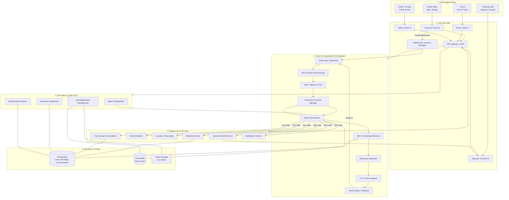
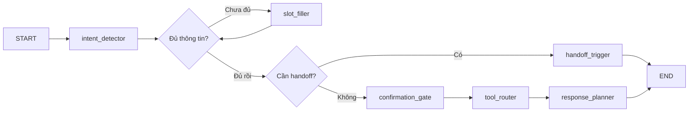
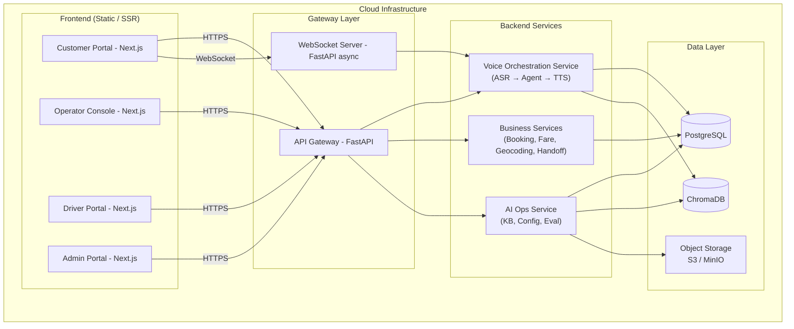

# AloSM Voice AI Agent — Architecture

**Phiên bản:** 1.1 · **Trạng thái:** Draft · **Liên kết:** [ALOSM_PRD.md](./ALOSM_PRD.md) · [ALOSM_Brief.md](./ALOSM_Brief.md)

> Tài liệu này mô tả kiến trúc kỹ thuật của AloSM Voice AI Agent — hệ thống cho phép khách hàng đặt xe và tra cứu thông tin bằng giọng nói tiếng Việt qua giao diện web. Đây là tài liệu nền cho giai đoạn MVP; các quyết định kỹ thuật được ghi lại kèm lý do để tiện review và thay đổi sau.

---

## 1. System Overview

AloSM Voice AI Agent là hệ thống hội thoại giọng nói theo kiến trúc **đa lớp (layered)**, hoạt động theo nguyên tắc:

- **Voice-First:** Người dùng nói — hệ thống xử lý, không yêu cầu thao tác màn hình.
- **Human-in-the-Loop:** AI xử lý các nghiệp vụ có quy trình cố định (đặt xe, hỏi giá, tra cứu trạng thái); con người tiếp nhận khi yêu cầu vượt phạm vi hoặc xuất hiện tình huống nhạy cảm.
- **Modular:** Mỗi lớp có trách nhiệm riêng biệt, có thể thay thế hoặc mở rộng độc lập.

**Sáu lớp chính:**

| Lớp | Tên | Trách nhiệm |
|---|---|---|
| 1 | Kênh người dùng | Điểm vào cho khách hàng, tổng đài viên, tài xế, admin |
| 2 | Lớp giao tiếp | UI, API Gateway, WebSocket |
| 3 | Voice & Conversation Orchestration | Xử lý giọng nói → văn bản → nghiệp vụ → phản hồi |
| 4 | Nghiệp vụ & Tích hợp | Booking, giá, geocoding, handoff, notification |
| 5 | Dữ liệu & Tri thức | Database, Vector Store, Object Storage |
| 6 | Vận hành & Quản trị AI | Knowledge Base, cấu hình Agent, monitoring |

---

## 2. Architecture Diagram



---

## 3. Components

### 3.1 Kênh Người Dùng

Bốn nhóm người dùng, mỗi nhóm có giao diện riêng phù hợp với vai trò:

| Người dùng | Giao diện | Chức năng chính |
|---|---|---|
| Khách hàng | Customer Portal (Web) | Gọi AI, xem transcript, xác nhận booking |
| Tổng đài viên | Operator Console (Web) | Tiếp nhận cuộc gọi từ AI, xem context, tạo/sửa booking |
| Tài xế | Driver Portal (Web/App) | Nhận chuyến, xem chi tiết, cập nhật trạng thái |
| Admin / AI Ops | Admin Portal (Web) | Cấu hình Agent, quản lý Knowledge Base, xem dashboard |

> Giai đoạn MVP: chỉ hỗ trợ web browser. Mobile native app và tích hợp tổng đài điện thoại (SIP/VoIP) là post-MVP.

---

### 3.2 Lớp Giao Tiếp

#### API Gateway

- Điểm vào duy nhất cho toàn bộ request từ mọi portal.
- Xác thực JWT, kiểm tra quyền theo role, rate limiting, định tuyến đến service phù hợp.
- Phát hiện và từ chối request không hợp lệ trước khi đến backend.

#### WebSocket / Session Manager

- Duy trì kết nối thời gian thực (persistent connection) cho toàn bộ phiên hội thoại.
- Stream audio 2 chiều: nhận audio từ microphone của khách, gửi audio phản hồi từ TTS.
- Quản lý trạng thái phiên: `idle` → `listening` → `processing` → `speaking` → `idle`.
- Hỗ trợ barge-in: phát hiện khách nói trong khi AI đang phát âm, dừng TTS ngay lập tức.

#### Authentication & Authorization

- **Cơ chế:** JWT — access token ngắn hạn (15 phút) + refresh token dài hạn.
- **Phân quyền:** RBAC với 4 roles: `Customer`, `Operator`, `Driver`, `Admin`.
- Mỗi role chỉ được gọi các API thuộc phạm vi của mình; API Gateway từ chối request sai role.

---

### 3.3 Voice & Conversation Orchestration

Pipeline xử lý hội thoại gồm 8 bước, chạy theo thứ tự:

```
Audio Input → VAD → ASR → Context Manager → Agent Orchestrator
                                                    ↓
                                          RAG / Tool Calls
                                                    ↓
                                         Response Generator → TTS → Audio Output
```

#### Bước 1 — Audio Input / Streaming

Nhận audio stream từ microphone của khách qua WebSocket. Audio được gửi theo từng chunk nhỏ để giảm độ trễ (streaming, không chờ toàn bộ câu).

#### Bước 2 — VAD & Audio Preprocessing

- **VAD (Voice Activity Detection):** Xác định khi nào người dùng bắt đầu và kết thúc nói, tránh gửi khoảng im lặng sang ASR.
- Lọc nhiễu nền cơ bản và chuẩn hóa âm lượng trước khi xử lý.

#### Bước 3 — ASR / Speech-to-Text

Chuyển giọng nói tiếng Việt thành văn bản. ASR cần hỗ trợ được giọng địa phương đa dạng và các địa danh phổ biến — đây là open question cần AI/ML xác nhận trước R1 (xem PRD mục 8).

#### Bước 4 — Transcript & Context Manager

- Lưu toàn bộ lịch sử hội thoại của phiên hiện tại (utterance của cả người dùng lẫn AI).
- Duy trì context đa lượt: các thông tin đã được xác nhận (địa chỉ, loại xe) không bị hỏi lại.
- Khi handoff sang tổng đài viên, toàn bộ transcript được chuyển kèm.

#### Bước 5 — Agent Orchestrator

Đây là thành phần trung tâm, điều phối toàn bộ luồng hội thoại.

**Kiến trúc Agent:** ReAct Agent với Dialogue State Management (dùng LangGraph).

**Trạng thái Agent (AgentState):**

```python
class AgentState:
    session_id: str
    user_id: str
    transcript: List[Message]       # lịch sử hội thoại
    intent: str                     # booking | info_query | cancellation | faq
                                    # | payment | refund | complaint
                                    # | driver_action | emergency | handoff
    dialogue_state: str             # collecting_info | confirming | executing | completed
    collected_slots: Dict           # pickup, dropoff, vehicle_type, payment_method,
                                    # complaint_type, trip_id, incident_type
    confidence_score: float         # độ tin cậy của lần nhận diện gần nhất
    failure_count: int              # số lần thất bại liên tiếp (ngưỡng handoff)
    is_emergency: bool              # True khi phát hiện tình huống khẩn cấp
    handoff_reason: Optional[str]   # lý do handoff nếu có
    tool_results: Dict              # kết quả từ tool calls gần nhất
```

**Các node trong Agent flow:**

| Node | Nhiệm vụ |
|---|---|
| `intent_detector` | Phân loại ý định từ utterance của người dùng |
| `slot_filler` | Hỏi từng thông tin còn thiếu, mỗi lượt đúng một câu hỏi |
| `confirmation_gate` | Đọc lại thông tin để người dùng xác nhận trước khi thực hiện |
| `tool_router` | Gọi tool phù hợp với intent đã xác định |
| `handoff_trigger` | Kích hoạt chuyển tổng đài viên theo điều kiện |
| `response_planner` | Sinh câu trả lời ngắn gọn, tự nhiên, phù hợp với giọng nói |

**Agent flow:**



**Điều kiện kích hoạt handoff:**

1. Người dùng chủ động yêu cầu gặp người thật.
2. `failure_count` ≥ 2 lần thất bại liên tiếp với cùng yêu cầu.
3. `confidence_score` dưới ngưỡng cấu hình (configurable).
4. `intent` được phân loại là nhạy cảm: khiếu nại, thanh toán, tai nạn.

**Danh sách tools:**

| Tool | Chức năng |
|---|---|
| `geocode_address` | Phân giải địa danh / địa chỉ tiếng Việt thành tọa độ; trả về danh sách nếu mơ hồ |
| `estimate_fare` | Ước tính giá chuyến theo điểm đón, điểm đến và loại xe |
| `create_booking` | Tạo booking sau khi người dùng xác nhận; trả về mã booking |
| `lookup_trip` | Tra cứu trạng thái chuyến đang có |
| `cancel_trip` | Hủy chuyến — chỉ thực hiện sau khi có xác nhận 2 chiều |
| `search_knowledge_base` | Tìm kiếm FAQ và chính sách dịch vụ trong Knowledge Base |
| `handoff_to_operator` | Chuyển transcript + context sang Operator Console (thông thường hoặc khẩn cấp) |
| `send_notification` | Gửi thông báo SMS hoặc push notification |
| `get_payment_history` | Lấy lịch sử thanh toán theo tài khoản đã đăng nhập (tối đa 5 giao dịch gần nhất) |
| `process_payment` | Gửi yêu cầu thanh toán đến Payment Service sau khi khách xác nhận rõ ràng |
| `submit_refund_request` | Tạo ticket hoàn tiền với thông tin chuyến và lý do; trả về mã ticket |
| `submit_complaint` | Tạo ticket khiếu nại với loại sự cố, mã chuyến và mô tả; phân loại mức ưu tiên |
| `update_driver_status` | Cập nhật trạng thái chuyến theo hành động của tài xế (đón khách, hoàn thành, v.v.) |
| `trigger_emergency` | Kích hoạt luồng khẩn cấp: ghi nhận sự cố, đẩy context sang Operator Console khẩn cấp trong ≤ 30 giây |

#### Bước 6 — RAG / Knowledge Retrieval

- Khi `search_knowledge_base` được gọi, truy xuất tài liệu phù hợp nhất bằng semantic search.
- Chỉ tài liệu có trạng thái **Đã xuất bản** mới được dùng để sinh câu trả lời.
- Nếu không có tài liệu đủ căn cứ, Agent báo "Chưa đủ thông tin" và đề nghị handoff — không tự suy diễn.

#### Bước 7 — Response Generator

- Sinh câu trả lời ngắn gọn, dùng ngôn ngữ tự nhiên nói (không dùng bullet point, Markdown hay ký hiệu đặc biệt — vì output sẽ được đọc bằng giọng nói).
- Áp dụng Voice Preferences (tốc độ, phong cách) theo nhóm người dùng nếu được cấu hình.

#### Bước 8 — TTS & Audio Output

- Chuyển văn bản phản hồi thành giọng nói tiếng Việt tự nhiên.
- Stream audio về client theo từng chunk — không chờ toàn bộ câu để giảm độ trễ.
- Hỗ trợ barge-in: dừng phát âm ngay khi phát hiện người dùng bắt đầu nói.

---

### 3.4 Nghiệp Vụ & Tích Hợp

| Service | Chức năng | Ghi chú |
|---|---|---|
| **Booking Service** | Tạo, cập nhật booking; trả kết quả cho Agent | MVP: real hoặc sandbox — cần xác nhận (OQ PRD) |
| **Fare Estimation** | Ước tính giá theo điểm đón/đến và loại xe | Giá trả về là ước tính, không phải giá chính thức |
| **Location / Geocoding** | Phân giải địa danh tiếng Việt thành tọa độ; xử lý kết quả mơ hồ | Trả về danh sách nếu có nhiều kết quả khớp |
| **Trip Lookup & Cancellation** | Tra cứu trạng thái chuyến; hủy chuyến kèm xác nhận | Hủy chỉ thực hiện sau `cancel_trip` + xác nhận 2 chiều |
| **Human Handoff Service** | Đẩy transcript + context sang Operator Console; hỗ trợ 2 queue: thông thường và khẩn cấp | Queue khẩn cấp có độ ưu tiên cao nhất, không bị chen hàng |
| **Notification Service** | Gửi SMS / push notification xác nhận booking, ticket, cập nhật trạng thái | Phụ thuộc provider bên ngoài; cần fallback khi gửi thất bại |
| **Payment Service** | Xử lý giao dịch thanh toán qua payment gateway tích hợp; trả lịch sử thanh toán | Không lưu thông tin thẻ; tuân thủ PCI-DSS; provider cần xác nhận (OQ ARCH) |
| **Refund & Complaint Service** | Tạo và quản lý ticket hoàn tiền / khiếu nại; phân loại mức ưu tiên; kết nối CRM | Ticket hoàn tiền không tự phê duyệt — quyết định thuộc tổng đài viên / hệ thống nội bộ |
| **Driver Support Service** | Tiếp nhận lệnh từ tài xế (xác nhận chuyến, cập nhật trạng thái); trả thông tin chuyến cho tài xế | Giao tiếp qua API Driver app; số điện thoại khách không trả toàn bộ |
| **Emergency Response Service** | Phát hiện, ghi nhận sự cố khẩn cấp; kích hoạt queue ưu tiên; đính kèm GPS và context | SLA: kết nối tổng đài viên khẩn cấp trong ≤ 30 giây; hoạt động độc lập ngay cả khi module khác lỗi |

---

### 3.5 Dữ Liệu & Tri Thức

| Store | Loại DB | Nội dung lưu trữ |
|---|---|---|
| Users & Roles | PostgreSQL (relational) | Tài khoản, phân quyền, consent ghi âm, preferences |
| Conversation History | PostgreSQL JSONB | Transcript phiên, dialogue state, tool results |
| Bookings | PostgreSQL (relational) | Thông tin booking, trạng thái chuyến, audit trail |
| Payments | PostgreSQL (relational) | Lịch sử giao dịch, phương thức thanh toán, trạng thái; **không lưu số thẻ** |
| Tickets (Refund & Complaint) | PostgreSQL (relational) | Ticket hoàn tiền / khiếu nại, mức ưu tiên, trạng thái xử lý, lịch sử cập nhật |
| Emergency Incidents | PostgreSQL append-only | Thời gian, vị trí GPS, mô tả sự cố, trạng thái xử lý; chỉ Operator và Admin được xem |
| Knowledge Base | ChromaDB (vector) + S3 | Embedding tài liệu FAQ/chính sách; file gốc trên object storage |
| Feedback & Audit Logs | PostgreSQL append-only | Đánh giá cuộc gọi, hành động nghiệp vụ, log bảo mật |

**Database migrations:** Alembic.

**Lưu ý quan trọng:**
- Transcript và ghi âm chỉ được lưu khi khách đã đồng ý (consent). Chính sách thời gian lưu trữ là open question — cần DPO xác nhận trước R1.
- Dữ liệu PII (số điện thoại, địa chỉ) được ẩn trong UI theo role; không đọc toàn bộ qua TTS.

---

### 3.6 Vận Hành & Quản Trị AI

| Module | Chức năng |
|---|---|
| **Knowledge Base Management** | Upload tài liệu (PDF, DOCX, TXT), kiểm thử truy xuất, xuất bản, rollback phiên bản |
| **Agent Configuration** | Chỉnh prompt hệ thống, ngưỡng confidence, số lần retry trước khi handoff — thay đổi chỉ áp dụng cho phiên mới |
| **Evaluation Dashboard** | Theo dõi: số cuộc gọi, task completion rate, HITL rate, CSAT, lỗi tool |
| **Monitoring & Analytics** | Real-time metrics, cảnh báo khi bất thường, phân tích cuộc gọi thất bại để cải thiện Agent |

---

## 4. Data Flow

### Luồng chính — Đặt xe bằng giọng nói

```
1. Khách nhấn "Gọi AI" → cấp quyền mic → WebSocket kết nối → phiên khởi tạo.
2. Khách nói → VAD phát hiện → Audio stream gửi sang ASR → transcript.
3. Context Manager lưu utterance, cập nhật lịch sử hội thoại.
4. Agent Orchestrator phân tích intent → xác định thông tin còn thiếu.
5. slot_filler hỏi từng thông tin một (pickup? dropoff? loại xe?).
   → Nếu địa chỉ mơ hồ: geocode_address trả danh sách → Agent liệt kê, hỏi chọn.
   → Lặp bước 2–5 cho đến khi đủ thông tin.
6. confirmation_gate: Agent đọc lại toàn bộ (điểm đón, điểm đến, loại xe, giá ước tính).
7. Khách xác nhận → create_booking gọi Booking Service → mã booking trả về.
8. Response Generator thông báo xác nhận → TTS phát → Notification Service gửi SMS.
```

### Luồng handoff — Chuyển tổng đài viên

```
1. Agent phát hiện điều kiện handoff (xem mục 3.3).
2. handoff_trigger gọi Human Handoff Service kèm: transcript đầy đủ, tóm tắt,
   thông tin đã thu thập, lý do handoff.
3. Operator Console hiển thị context TRƯỚC khi tổng đài viên tiếp nhận cuộc gọi.
4. Tổng đài viên tiếp nhận — không cần hỏi lại khách từ đầu.
```

### Luồng tra cứu thông tin / FAQ

```
1. Khách hỏi → Agent phân loại intent: info_query hoặc faq.
2. Với info_query (trạng thái chuyến): gọi lookup_trip → đọc kết quả.
3. Với faq (giá, chính sách): gọi search_knowledge_base → tổng hợp câu trả lời
   từ tài liệu đã xuất bản → trả lời kèm nguồn (không suy diễn).
4. Nếu không đủ căn cứ: báo rõ và đề nghị handoff.
```

### Luồng thanh toán qua giọng nói

```
1. Khách hỏi lịch sử hoặc yêu cầu thanh toán → Agent phân loại intent: payment.
2. get_payment_history → trả tối đa 5 giao dịch gần nhất → Agent đọc (không đọc số thẻ).
3. Khách chỉ định chuyến cần thanh toán và phương thức → confirmation_gate:
   Agent đọc lại số tiền và phương thức.
4. Khách xác nhận rõ ràng → process_payment gọi Payment Service →
   Payment Service gửi đến payment gateway.
5. Kết quả thành công/thất bại → Agent thông báo kết quả → Notification Service gửi SMS.
```

### Luồng tiếp nhận hoàn tiền / khiếu nại

```
1. Khách nói yêu cầu → Agent phân loại intent: refund hoặc complaint.
2. slot_filler thu thập: mã chuyến (hoặc ngày giờ), lý do, mô tả chi tiết.
3. Nếu liên quan đến an toàn (tai nạn, đe dọa) → chuyển ngay sang luồng khẩn cấp.
4. Nếu là hoàn tiền: submit_refund_request → tạo ticket → Agent đọc mã ticket
   và thời gian xử lý dự kiến.
5. Nếu là khiếu nại: submit_complaint → phân loại mức ưu tiên → tạo ticket.
6. Notification Service gửi SMS xác nhận ticket cho khách.
```

### Luồng hỗ trợ tài xế

```
1. Tài xế nói lệnh → Agent phân loại intent: driver_action.
2. Agent xác minh: tài xế đã đăng nhập và có chuyến đang hoạt động.
3. Với lệnh xác nhận (đón khách, hoàn thành): update_driver_status →
   cập nhật hệ thống → Agent đọc xác nhận.
4. Với truy vấn thông tin chuyến: Agent trả thông tin (địa chỉ, ETA) —
   số điện thoại khách chỉ trả 4 số cuối.
5. Với báo cáo sự cố thông thường: ghi nhận → thông báo khách nếu cần.
6. Với báo cáo sự cố nghiêm trọng: chuyển ngay sang luồng khẩn cấp.
```

### Luồng khẩn cấp (F9 — Priority: Must)

```
⚠ Luồng này có độ ưu tiên CAO NHẤT. Hoạt động độc lập kể cả khi module khác lỗi.

1. Agent phát hiện từ khóa khẩn cấp TRONG BẤT KỲ INTENT NÀO →
   đặt is_emergency = True, ngắt toàn bộ luồng hiện tại.
2. Agent thông báo ngay: "Đang kết nối bạn với tổng đài khẩn cấp."
3. trigger_emergency gọi Emergency Response Service với:
   - Transcript hiện tại + tóm tắt
   - Tọa độ GPS (nếu có)
   - Mã chuyến đang hoạt động
   - Thông tin tài xế và khách
4. Emergency Response Service tạo Emergency Incident Record và
   đẩy vào queue khẩn cấp của Human Handoff Service.
5. Tổng đài viên khẩn cấp được kết nối trong ≤ 30 giây và nhận
   đầy đủ thông tin trước khi nghe tiếng người gọi.
6. Nếu tổng đài viên đánh giá cần gọi 112: hỗ trợ kết nối từ Operator Console.
   Agent KHÔNG tự gọi 112.
```

---

## 5. Deployment Architecture



**Môi trường:**

| Môi trường | Container | Orchestration | Notes |
|---|---|---|---|
| Development | Docker Compose | — | Tất cả service chạy local |
| Staging | Docker | Kubernetes (optional) | Dùng để kiểm thử trước khi đưa production |
| Production | Docker | Kubernetes | Horizontal scaling, health checks, rolling deploy |

**CI/CD:** GitHub Actions — lint → test → build Docker image → deploy.

**Secrets:** `.env` per service (không commit vào repo); production dùng Vault hoặc cloud secret manager.

---

## 6. Security

| Hạng mục | Giải pháp |
|---|---|
| **Authentication** | JWT — access token 15 phút + refresh token; invalidate khi logout hoặc đổi mật khẩu |
| **Authorization** | RBAC — 4 roles: Customer / Operator / Driver / Admin; API Gateway kiểm tra trước khi forward |
| **Input Validation** | Pydantic v2 trên toàn bộ API endpoint; reject request không đúng schema |
| **Audio & Consent** | Ghi âm chỉ bắt đầu sau khi khách đồng ý; không ghi âm nếu từ chối |
| **PII Protection** | Số điện thoại không đọc toàn bộ qua TTS (chỉ 4 số cuối); ẩn trong UI theo role |
| **Payment Security** | Thông tin thẻ và tài khoản ngân hàng **không đi qua AI và không lưu trong hệ thống này**; chỉ giao tiếp với payment gateway đạt chuẩn PCI-DSS; Payment Service không trả về số thẻ đầy đủ |
| **Emergency Data** | Emergency Incident Record chỉ Operator và Admin được xem; không hiển thị trong dashboard chung |
| **API Keys & Secrets** | Không commit vào repo; production dùng Vault / cloud secret manager |
| **Rate Limiting** | Giới hạn request per IP và per user trên API Gateway; luồng khẩn cấp được miễn rate limit |
| **CORS** | Chỉ cho phép domain frontend đã cấu hình trong whitelist |
| **Audit Logging** | Mọi hành động nghiệp vụ (tạo booking, thanh toán, tạo ticket, hủy chuyến, handoff, thay đổi KB) đều ghi log với timestamp và actor |
| **Retention** | Chính sách thời gian lưu transcript và ghi âm cần DPO xác nhận — chưa chốt (xem Open Questions) |

---

## 7. Error Handling

| Tình huống lỗi | Hành vi hệ thống | Người dùng thấy gì |
|---|---|---|
| Mic bị từ chối / không khả dụng | Tự động hiển thị text input | Hướng dẫn chuyển sang nhập bàn phím |
| ASR thất bại (không nhận diện được) | Tăng `failure_count`; nếu ≥ 2 lần → đề nghị handoff | "Xin lỗi, tôi không nghe rõ. Bạn có muốn gặp tổng đài viên không?" |
| Tool call thất bại (Booking Service lỗi) | Thông báo lỗi thân thiện; đề xuất thử lại hoặc handoff | "Hệ thống đặt xe đang bận. Bạn muốn thử lại hay gặp tổng đài viên?" |
| Mất kết nối WebSocket | Lưu session state; thông báo và hỗ trợ reconnect | "Mất kết nối. Đang kết nối lại..." |
| Địa chỉ mơ hồ | Trả về danh sách tối thiểu 2 lựa chọn; hỏi người dùng chọn | AI liệt kê các lựa chọn và hỏi: "Bạn muốn đến địa điểm nào?" |
| Không đủ căn cứ KB | Báo rõ; không đoán; đề nghị handoff | "Tôi chưa có thông tin về vấn đề này. Bạn muốn gặp tổng đài viên không?" |
| Lỗi nội bộ không xác định | Log lỗi đầy đủ; hiển thị thông báo chung cho người dùng | "Có lỗi xảy ra. Vui lòng thử lại hoặc gặp tổng đài viên." |

**Nguyên tắc chung:** Không để lộ stack trace hay lỗi kỹ thuật ra giao diện người dùng. Mọi lỗi phải kết thúc bằng một hành động rõ ràng (thử lại / handoff / đóng phiên).

---

## 8. Design Decisions

| Quyết định | Lựa chọn | Lý do |
|---|---|---|
| **API Framework** | FastAPI (Python) | Async native, tự sinh OpenAPI docs, type-safe với Pydantic — phù hợp AI service |
| **Agent Architecture** | LangGraph ReAct | State machine tường minh, dễ debug từng bước dialogue, hỗ trợ multi-step tool use và conditional branching |
| **Realtime Communication** | WebSocket | Latency thấp cho audio streaming 2 chiều; hỗ trợ barge-in tự nhiên |
| **Database** | PostgreSQL | ACID cần thiết cho booking; JSONB linh hoạt cho dialogue state; một DB duy nhất giảm complexity ở MVP |
| **Vector Store** | ChromaDB | Dễ self-host, không cần cloud dependency ở MVP; migrate sang Pinecone / Weaviate khi cần scale |
| **Embeddings** | Vietnamese-optimized model | Độ chính xác retrieval cao hơn với tiếng Việt có dấu so với multilingual model chung |
| **Frontend** | Next.js | SSR, routing, TypeScript native, tích hợp WebSocket; cùng tech stack với nhiều frontend team Việt Nam |
| **Audio Pipeline** | Streaming chunk-by-chunk | Giảm perceived latency; cho phép barge-in; không chờ toàn bộ câu mới xử lý |
| **Handoff Strategy** | Human-in-the-Loop | AI chỉ tự động hóa nghiệp vụ có quy trình cố định; con người tiếp nhận khi cần phán đoán hoặc tình huống nhạy cảm |
| **Knowledge Management** | RAG + ChromaDB | Không cần fine-tune khi cập nhật chính sách; chỉ cần upload và publish tài liệu mới |
| **Containerization** | Docker + Kubernetes | Docker để nhất quán môi trường; Kubernetes để scale và rolling deploy ở production |

---

## 9. Open Technical Questions

Các câu hỏi kỹ thuật chưa được chốt, cần giải quyết trước khi phát triển các thành phần liên quan:

| Câu hỏi | Ảnh hưởng đến | Hạn chót |
|---|---|---|
| ASR provider nào đạt ngưỡng chính xác chấp nhận được với tiếng Việt đa giọng, đa môi trường? | Voice pipeline (Bước 3), fallback strategy | Trước R1 |
| Booking Service: kết nối hệ thống thật hay sandbox ở MVP? Giao tiếp qua REST hay message queue? | Booking Service, `create_booking` tool, error handling | Trước R1 |
| Chính sách lưu trữ transcript và ghi âm: thời gian lưu bao lâu, ai được xem, xóa theo quy trình nào? | Data layer, consent flow, audit log | Trước R1 (cần DPO) |
| Geocoding provider nào phủ tốt địa danh Việt Nam? Fallback khi không tìm thấy địa chỉ? | `geocode_address` tool, địa chỉ mơ hồ handling | Trước R1 |
| Ngưỡng confidence_score cụ thể để trigger handoff tự động là bao nhiêu? | Agent Orchestrator, handoff_trigger | Trước grooming Agent |
| TTS provider nào cho giọng nói tiếng Việt tự nhiên nhất trong phạm vi chi phí MVP? | TTS (Bước 8), Voice Library | Trước R1 |
| Deployment target ở MVP: self-host hay cloud managed (GKE, EKS...)? | Infrastructure, CI/CD pipeline | Trước R1 |
| AloSM dùng payment gateway nào (VNPay, MoMo, Stripe, v.v.)? API spec có sẵn chưa? Yêu cầu PCI-DSS cụ thể ra sao? | Payment Service, `process_payment` tool, security design | Trước grooming F6 |
| API Driver app có endpoint nào cho xác nhận chuyến và cập nhật trạng thái không? REST hay WebSocket? | Driver Support Service, `update_driver_status` tool | Trước grooming F8 |
| Khiếu nại đi vào CRM nào của AloSM? Có API tạo ticket không? Tiêu chí mức ưu tiên là gì? | Refund & Complaint Service, `submit_complaint` tool | Trước grooming F7 |
| Quy trình leo thang khẩn cấp: ai nhận cuộc gọi Emergency, queue riêng hay shared với thông thường? Kết nối 112 qua giao thức nào? | Emergency Response Service, Human Handoff Service queue | Trước grooming F9 |
| SLA 30 giây cho Emergency có khả thi với infrastructure hiện tại không? Cần test load như thế nào? | Emergency Response Service, Kubernetes HPA | Trước grooming F9 |
