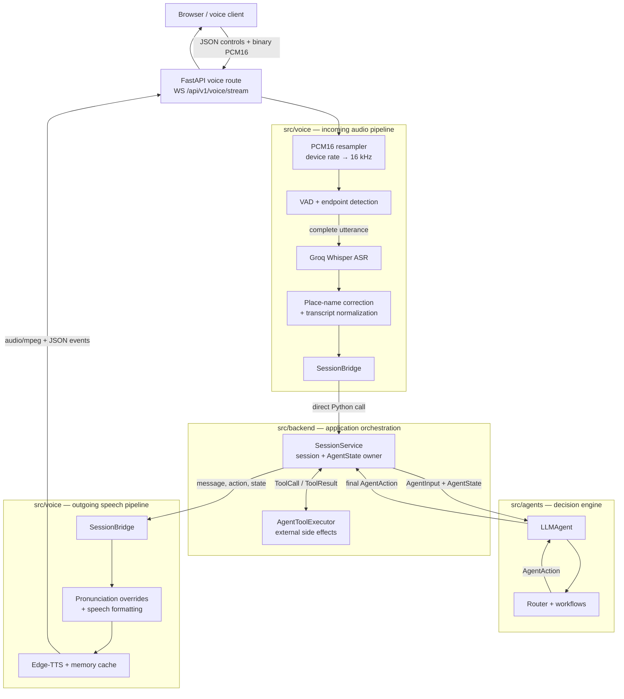

# Voice Gateway

`src/voice` contains the streaming voice runtime for AloSM. It converts microphone
audio into a transcript, sends that transcript to the Backend/Core Agent, converts
the Agent's reply back into speech, and returns both structured events and audio to
the client.

The package owns audio processing and provider adapters. It does **not** own booking
logic, execute business tools, or maintain a second copy of conversation state.

## Architecture



The communication is in-process: `SessionBridge` calls `SessionService` directly.
There is no HTTP call between Voice, Backend, and Agent modules.

## One streaming turn

1. The client connects to `WS /api/v1/voice/stream` and sends a `start_call`
   control message. The Backend route asks `VoiceGateway` to create a session.
2. `SessionBridge.start_session()` creates a Backend session with channel
   `WEB_VOICE` and an anonymous `voice_guest_*` user ID.
3. The client sends mono PCM16 microphone chunks as binary WebSocket frames.
4. `PCM16Resampler` converts the device sample rate (commonly 48 kHz) to 16 kHz.
5. VAD and `EndpointScorer` detect speech and close the utterance after the
   configured silence interval (900 ms by default).
6. `GroqASRProvider` sends the utterance to Groq Whisper. The gateway corrects known
   place names and normalizes the Vietnamese transcript.
7. `SessionBridge.send_message()` passes the transcript and ASR confidence to
   `SessionService.process_message()`.
8. `SessionService` loads `AgentState`, builds `AgentInput`, and calls
   `LLMAgent.handle()`. If the Agent returns `CALL_TOOL`, the Backend executes it via
   `AgentToolExecutor` and sends the resulting `ToolResult` back to the Agent.
9. The Backend persists the updated Agent state in the session and returns a stable
   result shape: `action`, `message`, `state`, and optional `booking`.
10. The gateway formats the reply for spoken Vietnamese, applies pronunciation
    overrides, and synthesizes MP3 audio through Edge-TTS.
11. The route sends `agent_message` and `audio_meta` JSON events, followed by the
    MP3 data in a binary WebSocket frame.

The gateway keeps only per-connection audio state (resampler, VAD/endpointing, and
UI stage). Conversation and business state belong to `SessionService`/`AgentState`.

## Providers

| Capability   | Streaming gateway provider                               | Selection                                                                                 |
| ------------ | -------------------------------------------------------- | ----------------------------------------------------------------------------------------- |
| ASR/STT      | Groq Whisper, model`whisper-large-v3-turbo` by default | Used when`GROQ_API_KEY` is configured                                                   |
| ASR fallback | `FakeASRProvider`                                      | Used without a Groq key and during pytest; it is for development/CI, not real recognition |
| TTS          | Edge-TTS, voice`vi-VN-HoaiMyNeural` by default         | Always used by the streaming gateway; no API key required                                 |
| VAD          | Energy-based VAD                                         | Default and suitable for development/tests                                                |
| Optional VAD | Silero VAD through ONNX Runtime                          | Enabled with`VOICE_VAD_BACKEND=silero` and a model path                                 |

Groq receives WAV-wrapped 16 kHz PCM audio and returns `verbose_json`. Because
Whisper does not provide a direct confidence field, `GroqASRProvider` estimates it
from segment log probabilities and no-speech probabilities. The gateway also rejects
very quiet utterances before ASR and applies a stricter confidence threshold while a
booking confirmation is pending.

Edge-TTS is accessed through the `edge-tts` package and returns MP3 audio. It uses an
unofficial Microsoft speech endpoint, so it should be treated as a best-effort
provider. `CachingTTSProvider` caches repeated phrases in process memory.

## Backend and Agent boundaries

`src/backend/api/routes/voice.py` is the transport adapter. It translates WebSocket
frames into `VoiceGateway` calls and translates gateway outputs back into JSON or
binary frames. `VoiceGateway` itself has no FastAPI or WebSocket dependency.

`session_bridge.py` is the only file in `src/voice` allowed to import Backend code.
It isolates the gateway from the current dialogue implementation:

```text
VoiceGateway
    → SessionBridge
        → SessionService
            → LLMAgent
            → AgentToolExecutor
```

The Agent never receives audio. It receives an `AgentInput` containing the normalized
transcript, session/turn identifiers, ASR confidence, and optionally a tool result.
It returns an `AgentAction`; the Backend applies state updates and performs any side
effects. The Voice module only consumes the final message/action and renders the
reply for the client.

## WebSocket protocol

Connect to:

```text
ws://<host>/api/v1/voice/stream
```

Client-to-server JSON control frames:

```json
{"type":"start_call","payload":{"channel":"WEB_VOICE","sample_rate":48000}}
{"type":"ping","payload":{}}
{"type":"end_call","payload":{"reason":"USER_ENDED"}}
```

After `start_call`, client-to-server binary frames must contain mono, little-endian
PCM16 audio. Server-to-client JSON event types are:

- `session_ready`
- `status` (`LISTENING`, `PROCESSING`, `SPEAKING`, `HANDED_OFF`, or `ENDED`)
- `transcript`
- `agent_message`
- `audio_meta`
- `handoff`
- `error`
- `session_ended`

An `audio_meta` event is immediately followed by a binary MP3 frame.

## Two voice API paths

The repository currently has two voice implementations. They share
`SessionService` and the Core Agent, but they do not share providers or transport:

| API                                                          | Implementation                                                                             | Providers                    | Current role                                                 |
| ------------------------------------------------------------ | ------------------------------------------------------------------------------------------ | ---------------------------- | ------------------------------------------------------------ |
| `WS /api/v1/voice/stream` and `POST /api/v1/voice/speak` | `src/voice` plus the Backend route adapter                                               | Groq ASR + Edge-TTS          | Streaming gateway documented here                            |
| `POST /api/v1/voice/turn`                                  | `src/backend/services/voice_service.py` and `src/backend/integrations/voice_client.py` | OpenAI ASR/TTS or Gemini ASR | Whole-recording REST path currently used by the web frontend |

Do not configure `VOICE_PROVIDER` expecting it to change the streaming gateway. That
setting only selects OpenAI/Gemini for `/voice/turn`. The gateway uses
`GROQ_API_KEY` and the `VOICE_*` settings defined in `src/voice/config.py`.

## Configuration

```env
VOICE_ENABLED=true
GROQ_API_KEY=
VOICE_ASR_MODEL=whisper-large-v3-turbo
VOICE_ASR_LANGUAGE=vi
VOICE_EDGE_TTS_VOICE=vi-VN-HoaiMyNeural
VOICE_TTS_RATE=1.0
VOICE_VAD_BACKEND=energy
VOICE_VAD_SILENCE_MS=900
VOICE_SILERO_MODEL_PATH=
VOICE_MIN_UTTERANCE_RMS=0.01
VOICE_BOOKING_CONFIRMATION_CONFIDENCE_THRESHOLD=0.80
```

Settings are loaded from environment variables or the repository-level `.env` file
by `VoiceSettings` in `config.py`.

## Package layout

```text
src/voice/
├── gateway.py              # provider-independent turn orchestration
├── session_bridge.py       # only Voice → Backend integration seam
├── schemas.py              # provider results and WebSocket contracts
├── config.py               # streaming gateway settings
├── audio/
│   ├── codec.py            # PCM16 conversion and streaming resampling
│   └── vad.py              # Energy/Silero VAD and endpoint detection
├── asr/
│   ├── base.py             # ASR provider protocol
│   ├── groq_provider.py    # Groq Whisper implementation
│   ├── biasing.py          # place-name correction
│   └── confidence.py       # confidence helpers/policies
├── text/
│   ├── gazetteer.py        # known place-name vocabulary
│   └── normalizer.py       # transcript normalization
└── tts/
    ├── base.py             # TTS provider protocol
    ├── edge_tts_provider.py
    ├── cache.py
    ├── formatter.py        # numbers/currency to spoken text
    └── pronunciation.py    # brand/place pronunciation overrides
```

## Run and test

From the repository root:

```bash
uvicorn src.backend.main:app --reload
```

Useful endpoints:

```text
GET  /api/v1/voice/health
POST /api/v1/voice/speak
WS   /api/v1/voice/stream
```

Run the Voice tests without calling real providers:

```bash
pytest tests/test_voice -v
pytest tests/test_api/test_voice_routes.py -v
```

## Current limitations

- The web frontend currently calls `/voice/turn`, not the streaming `/voice/stream`
  gateway. A WebSocket client must be connected before this gateway becomes the
  browser's active voice path.
- Voice session and TTS cache state are in process memory and are lost on restart.
- Energy VAD is less robust in noisy environments; Silero requires an ONNX model and
  `onnxruntime`.
- Edge-TTS uses an unofficial external endpoint and has no availability guarantee.
